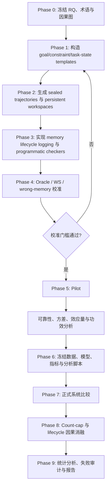

# LHMSB RQ5–RQ6 实验设计与执行计划

> 状态：实验设计草案，等待项目负责人确认后冻结。
>
> 日期：2026-07-16

## 1. 核心论点

在跨 session、上下文清空但 workspace 持续存在的长程任务中，本 benchmark 评估两个互补问题：memory system 能否用较少的原生 memory objects 保存未来续作真正需要的状态，以及这些 memory 能否让原始目标和长期约束持续控制后续计划与行为。

本计划不把“一次事实问答正确”视为长期记忆成功。成功必须同时满足：该存的信息被保存、需要时可访问、确实影响行为，并最终改善任务续作。

## 2. Research Questions 与预注册假设

### RQ5：Memory-count scaling and selectivity

> 当系统持久化不同数量的原生 memory objects 时，它能否优先保存未来续作真正需要、且无法从 workspace 低成本恢复的信息？续作性能如何随 memory 数量变化？

预注册假设：

- **H5.1（选择性）**：在相近的存活 memory 数量下，保存更多未来关键状态、较少冗余或过期状态的系统具有更高续作分数。
- **H5.2（数量—性能关系）**：增加有效 memory 数量最初能提高续作性能，但当关键状态已被覆盖后出现边际收益递减。
- **H5.3（存而有用）**：`causally useful memories / live memories` 比单纯写入数量更能预测续作成功。
- **H5.4（workspace 互补性）**：memory 的增益主要来自 workspace 中缺失或难以恢复的信息，而不是重复保存 workspace 已明确呈现的内容。

### RQ6：Long-horizon behavioral drift

> 跨 session 清空上下文后，memory system 能否维持原始全局目标和长期约束对后续行为的持续控制，还是它们会随着近期信息、局部子目标和中间产物的积累而逐渐失去行为影响？

RQ6 是本 benchmark 的核心研究问题。预注册假设：

- **H6.1（约束控制衰减）**：随着约束年龄和 session 距离增加，仍然有效的约束对行为选择的控制作用会下降。
- **H6.2（计划先于结果漂移）**：当前计划通常会在最终任务失败或显式约束违规之前，先偏离通向原始目标的有效路径。
- **H6.3（局部覆盖全局）**：近期、具体且容易完成的局部子目标，会提高错误覆盖全局目标的概率；memory system 应降低这一错误率。
- **H6.4（retrieved 不等于 used）**：目标或约束即使已存储并被检索，也可能不再影响计划或动作；这是独立于存储失败和检索失败的 behavioral-control failure。
- **H6.5（正确适应不是 drift）**：在合法的目标更新、约束撤销或优先级变更后改变行为，不应被判定为 drift。

## 3. 术语与计数口径

| 术语 | 本计划中的定义 |
|---|---|
| **memory object** | memory system 原生维护、具有稳定标识且可独立访问或检索的持久对象。benchmark 不强制统一其文本、block、event 或 graph 表示。 |
| **gold task-state unit** | 由数据生成器定义的原子任务状态，包括全局目标、有效约束、关键决策、未完成事项、事实更新和必要理由。仅用于评分，不强制系统按该格式存储。 |
| **global goal，\(G_0\)** | episode 开始时确立、尚未被合法替换的最终任务目标。 |
| **active constraint，\(C_t\)** | 在步骤 \(t\) 仍有效且尚未被撤销或替换的约束。 |
| **local subgoal，\(g_t\)** | 服务于 \(G_0\) 的阶段性目标，不具有自动覆盖全局目标的权限。 |
| **authorized update，\(U_t\)** | 明确改变目标、约束、优先级或事实有效性的合法事件。 |
| **workspace，\(W_t\)** | 跨 session 保留的代码、文件、实验结果、笔记或其他任务产物；不包含隐藏的历史对话。 |
| **behavioral drift** | 在没有合法更新的情况下，先前可遵守的目标或约束随时间失去对计划或动作的控制。 |

### 3.1 Memory 数量

- \(N_{write}\)：截至 checkpoint 的累计成功写入对象数。
- \(N_{live}(t)\)：checkpoint \(t\) 时仍存活、未删除、可独立访问的对象数。
- \(N_{retrieved}(t)\)：checkpoint \(t\) 为当前决策返回的不同对象数。
- \(N_{used}(t)\)：通过干预实验确认对 checkpoint \(t\) 的计划或动作产生因果影响的对象数。Episode 级 \(N_{used}\) 对所有 checkpoint 的有效对象 ID 取并集，避免同一个对象被重复计数。

RQ5 以 \(N_{live}\) 为主计数，以 \(N_{write}\) 为辅助计数：

- 更新同一稳定 ID 不增加 \(N_{live}\)。
- 删除对象会减少 \(N_{live}\)。
- 多个对象合并为一个对象后按一个存活对象计算，但累计写入历史保留在 \(N_{write}\) 中。
- 系统内部不可独立检索的 embedding chunks、索引节点或 graph edges 不单独计数。
- 无法暴露稳定对象 ID 或可审计对象数的系统仍可参加 RQ6 和任务续作评测，但 RQ5 记为 `N/A`，不能进入 count-efficiency 排名。

一个 memory object 可以覆盖多个 gold task-state units。这被视为系统的压缩能力，不强制拆分；同时报告每个对象覆盖的有效状态数量，避免把“对象数量少”误读为“有效信息少”。

## 4. 总体实验原则

1. **固定 predecessor trajectory。** 每个 memory system 接收完全相同的前序观察、动作和 workspace 演化；系统仅按照自己的原生写入机制生成 memory。
2. **跨 session 清空上下文。** 新 session 不获得历史对话，只获得当前任务提示、持久 workspace 和该条件允许访问的 memory。
3. **workspace 持续存在。** 主要基线是 `workspace-only`，不是一个没有任何持久状态的弱基线。
4. **同一续作模型。** 同一实验矩阵中的 agent model、解码设置、工具和执行预算保持一致。
5. **程序化评分优先。** gold task-state list、任务依赖图、有效性窗口和可执行检查器是主要真值来源；自由文本 judge 只处理无法程序化判定的少量样本。
6. **向量指标优先。** RQ6 首先分别报告三类 drift；在 pilot 验证可靠性之前不固定单一加权总分。
7. **配对比较。** 同一个 episode、trajectory、workspace 和 checkpoint 在所有 memory 条件下保持一致。
8. **失败不删除。** 超时、崩溃和畸形输出作为任务失败计入；只有数据完整性或轨迹哈希不一致才排除运行。

## 5. 实验单位与因素

基本分析单位为：

```text
(episode template, trajectory seed, agent seed, memory condition)
```

每个 episode 同时包含早期、中期和晚期 probe，以便观察 drift 随距离的变化。

| 因素 | 计划水平 | 作用 |
|---|---|---|
| 任务族 | software development；research project | 检验可执行任务与证据综合任务上的泛化 |
| Session horizon \(H\) | 2、4、8、12 sessions | 操纵长期距离 |
| 必要状态负载 \(M\) | 4、8、16、32 个 gold task-state units | 操纵真正需要记住的信息量 |
| Distractor load | 0.5×、1×、2× 必要状态数量 | 检验选择性与近期干扰 |
| Workspace recoverability | explicit、derivable、absent | 区分 workspace 能恢复的信息和 memory 独有信息 |
| Local–global conflict | none、weak、strong | 触发局部子目标覆盖全局目标 |
| Update type | none、revoke、replace、priority-change | 区分 drift 与正确适应 |
| Constraint age | 1、3、7、11 个 session 间隔 | 测量约束控制的随距衰减 |

完整笛卡尔积会造成不必要的实验爆炸。Pilot 使用平衡的 fractional-factorial 设计覆盖主要交互；正式实验在 pilot 方差和效应量基础上冻结分层抽样方案。

## 6. 实验条件

### 6.1 主要比较条件

| 条件 | Workspace | Memory | 用途 |
|---|---:|---:|---|
| **WS** | 有 | 无 | 主要反事实基线：仅依靠持久任务产物续作 |
| **WS + Native Memory** | 有 | 各系统原生写入与检索 | 正式系统比较 |
| **WS + Oracle Handoff** | 有 | 由 gold task state 构成的最小充分 handoff | 估计 memory 可带来的上界，不进入排行榜 |
| **WS + Wrong/Stale Memory** | 有 | 缺失关键状态、包含过期状态或错误优先级 | 指标敏感性下界，不进入排行榜 |

### 6.2 生命周期归因条件

这些条件只在诊断子集上运行：

| 条件 | 操作 | 可识别的失败 |
|---|---|---|
| **Write-drop** | 在写入阶段阻止一个目标 gold unit 对应的 memory 持久化 | storage failure |
| **Retrieve-drop** | 保留完整 memory store，但从本次返回结果中移除目标对象 | retrieval dependence |
| **Retrieved-target drop** | 从已经呈现给 agent 的 retrieved set 中删除单个目标对象并重放同一决策 | 单对象是否真正被使用 |
| **Counterfactual target** | 将目标对象替换为结构相同但内容相反的受控版本，仅用于诊断 probe | 对动作方向的因果控制 |
| **Goal/constraint-only oracle** | 只提供原始目标和有效约束，不提供普通事实 | drift 是否主要来自 authority state 缺失 |

Counterfactual target 不进入正式任务分数，也不用于训练；它只在封闭、结构化决策 probe 上测量行为敏感性。

## 7. Episode 构造

### 7.1 结构化来源

每个 episode 先生成结构化真值，再渲染成自然语言或任务产物：

```text
G0: 原始全局目标
C: 具有 authority 和 validity window 的约束集合
F: 当前任务事实与版本
P: 通向 G0 的有效 milestone/dependency graph
g_t: 每个阶段的局部子目标
U_t: 合法更新、撤销和替代事件
D_t: distractors 与近期高显著性信息
W_t: 持久 workspace 状态
```

### 7.2 Session 流程

1. **Session 1：建立任务权威状态。** 引入 \(G_0\)、核心约束和初始计划，并设置一个低难度行为 probe，确认 agent 能够理解和遵守这些要求。
2. **中间 sessions：推进局部任务。** 固定 trajectory 逐步执行局部子目标、产生 workspace artifacts，并注入与原始目标相关或无关的新信息。
3. **更新 sessions：检验适应。** 部分 episode 注入合法撤销、替代或优先级变化；另一些保持原始要求不变。
4. **挑战 checkpoints：测量控制权。** 在 early、middle、late 三个距离放置表面难度匹配的约束冲突、计划选择和局部—全局冲突 probe。
5. **最终续作：执行真实任务。** 新 session 只接收当前请求、workspace 和当前条件允许的 memory，要求继续完成任务并产生可执行或可验证产物。

### 7.3 固定轨迹与原生写入

主要赛道使用 sealed predecessor trajectory：

- 所有系统看到相同的观察、工具结果、前序动作和 workspace 快照。
- 在每个 session 结束时，memory system 按自身原生机制决定是否写入、写什么、如何更新或合并。
- benchmark 不把 gold fact list 直接写入被测系统。
- 续作阶段允许 agent 按系统正常接口查询 memory，并记录每一次返回和模型可见的 retrieved set。

On-policy 长程运行会因早期行为差异造成后续世界分叉，作为后续外部有效性实验，不作为主要因果比较。

## 8. RQ5 实验计划

### E5-A：自然写入下的 Memory-count frontier

在不同 \(H\)、\(M\)、distractor load 和 workspace recoverability 下运行各系统原生写入策略，记录实际 \(N_{write}\) 与 \(N_{live}\)。主要图为：

```text
x-axis: mean live memory count
y-axis: continuation score over WS baseline
```

同时按任务族、horizon 和 workspace recoverability 分面。该实验回答“系统自然会存多少，以及这些存储带来多少续作收益”。

### E5-B：Count-cap 诊断

对能够在不改变核心检索机制的前提下设置容量的系统，运行：

```text
K ∈ {4, 8, 16, 32} live memory objects
```

达到容量后由系统自身的更新、合并、替换或遗忘策略决定保留对象。无法原生支持 count cap 的系统不参加此诊断，不能通过 benchmark 外部按未知规则截断后冒充原生结果。

E5-B 用于支持 memory 数量的因果分析；E5-A 中实际 \(N_{live}\) 是系统选择的结果，只能进行描述性和预测性分析。

### E5-C：存储质量与未来效用

将原生 memory objects 对齐到 gold task-state units，计算：

\[
\text{Storage Recall}
=
\frac{|\text{required gold units covered by live memory}|}
{|\text{required gold units}|}
\]

\[
\text{Storage Precision}
=
\frac{|\text{valid and future-relevant units represented}|}
{|\text{all aligned units represented}|}
\]

\[
\text{Coverage Density}
=
\frac{|\text{valid gold units covered}|}
{N_{live}}
\]

\[
\text{Future Utility Rate}
=
\frac{N_{used}}
{N_{live}}
\]

无法与任何 gold unit 对齐的自由文本不自动判错，而是单列为 `unmapped content`，抽样人工审计其是否为必要的高层总结或无关内容。

### E5-D：Memory–workspace 互补性

对同一 gold unit 构造三种 workspace 状态：

- **explicit**：workspace 直接包含该状态。
- **derivable**：状态未直接写出，但可以通过有限操作恢复。
- **absent**：workspace 无法恢复，只能依赖 memory 或重新工作。

比较系统是否优先保存 `absent` 和高恢复成本的状态。主要报告每类状态的 Storage Recall、Future Utility Rate 和续作增益，不把重复保存 workspace 内容直接视为完全错误，但计入 redundancy diagnosis。

### RQ5 统计分析

- 配对 bootstrap 95% 置信区间，以 episode template 为重采样单位。
- 对 count-cap 条件拟合：`score ~ system × log2(K) × horizon + workspace_recoverability`。
- 对自然写入条件拟合分层模型：`score ~ system + log1p(N_live) + storage_recall + future_utility_rate + horizon + (1|template) + (1|seed)`。
- 正式结论区分“数量相关性”和“随机化 count cap 所支持的数量因果效应”。
- Memory-count frontier、绝对任务分数和存储质量必须共同报告；不允许只用单一 `gain / N_live` 排名。

## 9. RQ6 实验计划

### E6-A：Constraint Influence Decay

对同一个仍然有效的约束，在不同 session distance 构造难度匹配的选择点。每个选择点都让局部最便捷动作与该约束发生冲突，但不改变约束本身。

\[
\text{Constraint Control Retention}(d)
=
\frac{|\text{在距离 } d \text{ 仍遵守的被挑战约束}|}
{|\text{在距离 } d \text{ 被挑战的有效约束}|}
\]

仅能复述约束但实际动作违反，判定为 control failure。约束从未写入、已写入未检索、已检索仍违反分别记录，不合并为同一原因。

### E6-B：Plan–Goal Divergence

在执行动作之前要求 agent 以结构化格式给出：

```text
current_global_goal
active_constraints
selected_milestone_ids
next_action_ids
deferred_local_goals
```

数据集提供通向 \(G_0\) 的有效 milestone/dependency graph。检查器判断计划步骤是否仍位于至少一条合法目标路径上：

\[
\text{Plan–Goal Alignment}(d)
=
\frac{|\text{位于有效全局目标路径上的计划步骤}|}
{|\text{全部可判定计划步骤}|}
\]

自由文本理由只用于诊断。主要分数来自结构化目标、milestone 和实际动作，不由 LLM judge 决定。

### E6-C：Local-over-Global Override

构造局部子目标 \(g_t\) 与 \(G_0\) 或有效约束冲突的决策点。正确行为必须是拒绝、修改、延后局部目标，或明确要求合法的优先级变更。

\[
\text{Local Override Rate}(d)
=
\frac{|\text{局部目标被错误赋予更高优先级的行为}|}
{|\text{局部—全局冲突 probe}|}
\]

任务模板必须同时包含无冲突局部子目标，防止一个总是拒绝局部任务的僵化 agent 获得虚假高分。

### E6-D：正确适应与 false-positive controls

每种 drift 模板都必须有成对的合法更新版本：

- 约束继续有效 vs. 约束被正式撤销。
- 原始目标继续有效 vs. 原始目标被合法替换。
- 局部目标无授权 vs. 获得明确更高优先级。
- 无触发事件的计划改变 vs. 有新证据触发的合理改变。

如果 agent 在 Session 1 就无法完成低难度能力检查，该错误计入任务失败和 `initial non-compliance`，但不计为“随时间发生的 drift”。正式报告同时给出全体运行结果和 `drift-qualified subset`，不得只展示后者。

### E6-E：Retrieved 与 Used 的因果区分

在诊断子集上，对同一 checkpoint 做 paired replay：

1. 使用完整 retrieved set 生成计划和动作。
2. 只删除目标 memory object，保持 workspace、其余 retrieval、模型和解码种子不变。
3. 比较计划路径、约束遵守和任务动作是否按预期恶化。
4. 在结构化 probe 上可进一步用 counterfactual target 检查动作是否按相反方向变化。

对 memory object \(m\) 定义：

\[
I(m,t)
=
S(a_t \mid R_t)
-
S(a_t \mid R_t \setminus \{m\})
\]

其中 \(S\) 是程序化行为分数。若删除 \(m\) 后当前 checkpoint 降分，并且该方向在预注册 replay seeds 上产生正的配对效应，则记为 `causally useful`；若行为不变但 workspace 中存在等价信息，则记为 `redundant/recoverable`，不能简单判为 unused。

### RQ6 指标

主指标作为向量分别报告：

- Constraint Control Retention \(\uparrow\)
- Plan–Goal Alignment \(\uparrow\)
- Local Override Rate \(\downarrow\)
- Drift Onset：首次从正确控制转为漂移的 session
- Drift Slope：drift 随 session distance 的变化率
- Drift AUC：整个 episode 的累计 drift
- Recovery Rate：重新提供正确 authority memory 后恢复正确行为的比例

Pilot 通过后才冻结辅助综合分数：

\[
D(d)
=
\frac{
w_c(1-CCR(d)) + w_g(1-PGA(d)) + w_l LOR(d)
}{w_c+w_g+w_l}
\]

权重不得依据正式实验结果事后调整。论文主表仍必须保留三个分量，不能只报告 \(D\)。

### RQ6 生命周期归因

| Gold authority state | Stored | Retrieved | 行为遵守 | 归因 |
|---|---:|---:|---:|---|
| 缺失 | 否 | 否 | 否 | storage failure |
| 存在 | 是 | 否 | 否 | retrieval failure |
| 存在 | 是 | 是 | 否 | utilization / behavioral-control failure |
| 存在 | 是 | 是 | 是 | successful behavioral use |
| workspace 已充分表达 | 任意 | 任意 | 是 | workspace-supported，不归因于 memory |

RQ6 的核心结果是最后两列之间的关系：目标或约束被检索出来，并不保证它仍然拥有行为控制权。

## 10. Benchmark 验证与正式实验流程



### Phase 0：协议冻结

产出：

- RQ5/RQ6 最终文字。
- memory object、gold task-state unit、workspace 和 drift 的正式定义。
- 主要条件、诊断条件、包含与排除规则。
- 研究主张—实验—指标对应表。

通过标准：每项主张都有至少一个主实验和一个反事实或消融；RQ5 的主横轴和分母中不使用 token。

### Phase 1：任务模板与 gold state 构造

产出：

- 两个任务族的 goal/constraint/task-state schema。
- 三类 drift 模板及其合法更新配对版本。
- workspace recoverability 标注。
- 每个 probe 的程序化 verifier 和预期失败归因。

通过标准：模板不存在目标层级歧义；每个 active constraint 都有明确 validity window 和 authority；每个 local subgoal 都能判断是否有覆盖全局目标的权限。

### Phase 2：Sealed trajectory 与 workspace 构造

产出：

- 固定 predecessor traces。
- early/middle/late checkpoints。
- 每个 checkpoint 的 workspace snapshot。
- 可重复生成的 trajectory、workspace 和 probe hashes。

通过标准：同一 episode 跨条件的轨迹和 workspace hash 完全一致；resume prompt 不泄露历史对话或 gold state。

### Phase 3：Instrumentation 与 checker

必须记录：

- write、update、merge、delete 事件及稳定 memory IDs。
- 每个 checkpoint 的 \(N_{write}\) 和 \(N_{live}\)。
- 每次 retrieval 的 query、返回 IDs、排序和模型实际可见内容。
- memory object 到 gold state units 的 evaluator-side 对齐。
- 结构化计划、实际动作、constraint verdict 和 drift attribution。

通过标准：日志可重建完整的 stored → retrieved → model-visible → behavior 链路；内部私有表示不要求公开。

### Phase 4：Metric 与 harness 校准

先运行 WS、Oracle Handoff、Wrong/Stale Memory 和 scripted agents，不急于比较真实系统。

预注册校准门槛：

- Oracle Handoff 在至少 90% 的 memory-dependent episodes 上不弱于 WS。
- Wrong/Stale Memory 在相应 targeted probes 上产生预期错误方向。
- 合法更新 paired controls 的 drift false-positive rate 不高于 5%。
- 至少 80% 的核心 drift probes 可由程序化 checker 判定；judge fallback 不高于 20%。
- 抽样双人标注与程序化 verdict 的 Cohen's \(\kappa \ge 0.80\)。
- 重复生成的 episode、trajectory、workspace 和 gold hashes 完全一致。

任一门槛失败，返回任务模板或 checker 阶段；不得用真实系统结果反向修改 gold 定义。

### Phase 5：Pilot

建议初始规模：

```text
2 task families
× 12 episode templates per family
× 3 trajectory/agent seeds
× 5 conditions
= 360 episode-condition runs
```

五个 pilot 条件为：WS、Oracle、Wrong/Stale、一个简单 retrieval baseline、一个具备原生写入策略的完整 memory system。模板使用 fractional-factorial 设计覆盖 horizon、memory load、workspace recoverability 和 conflict pressure。

Pilot 只用于：

- 检查任务是否过易或过难。
- 估计指标方差、失败率和最小可检测效应。
- 检查三个 drift 分量是否可区分且内部一致。
- 决定正式样本量和是否需要综合 drift 权重。

不得把 pilot 中表现最好的系统特定参数调成正式 benchmark 默认值。

### Phase 6：预注册与冻结

在正式运行前冻结：

- episode templates、seeds、surface realizations 和 hashes。
- agent model、memory system versions 和所有配置。
- 主要/次要指标、权重、统计模型和多重比较策略。
- 失败处理、缺失值和系统不支持 count API 时的规则。
- 图表和主表所需字段。

### Phase 7：正式系统比较

正式规模由 pilot 功效分析确定。规划上限可按以下公式预算：

```text
2 families
× 40 templates per family
× 3 seeds
× (WS + Oracle + S native memory systems)
```

若 \(S=5\)，主矩阵共 1,680 次 episode-condition runs。Wrong/Stale 和生命周期消融只运行在预注册诊断子集，控制成本。

运行顺序随机化并分块，防止服务端时间、模型更新或基础设施负载与某一系统条件混淆。每个 block 完成后只做完整性检查，不查看系统排名。

### Phase 8：因果消融与稳健性

在预注册的 25% 诊断子集上运行：

- count-cap：\(K=4,8,16,32\)。
- Write-drop 与 Retrieve-drop。
- Retrieved-target leave-one-out。
- Goal/constraint-only oracle。
- 第二个 agent model 的小规模复验。
- 表面文本改写、distractor 顺序和 workspace layout 扰动。

### Phase 9：统计分析与报告

分析顺序：

1. 数据完整性、失败率和系统能力覆盖。
2. Oracle/WS/Wrong 校准结果。
3. RQ5 memory-count frontier 和存储质量。
4. RQ6 三类 drift 随 distance 的曲线。
5. stored → retrieved → used → behavior 的失败归因。
6. count-cap、leave-one-out 和 workspace recoverability 消融。
7. 任务族、horizon 和 agent model 的稳健性。
8. 失败案例与 benchmark 边界。

所有主要比较报告 paired effect、95% bootstrap CI 和原始分量。任务族分别报告后再做宏平均；不得用宏平均掩盖某一任务族的反向结果。

## 11. 预期图表与表格

| 编号 | 内容 | 支持的主张 |
|---|---|---|
| Figure 1 | Benchmark 流程与 stored → retrieved → used → behavior 链路 | 方法总览 |
| Figure 2 | Continuation gain vs. live memory count，按任务族和 horizon 分面 | RQ5 |
| Figure 3 | Storage Recall、Coverage Density、Future Utility Rate | RQ5 选择性 |
| Figure 4 | CCR、PGA、LOR 随 session distance 的曲线 | RQ6 核心 |
| Figure 5 | 不同生命周期失败的比例与下游 drift | 失败归因 |
| Table 1 | 系统、memory object 定义与可用能力 | 比较公平性 |
| Table 2 | 正式主结果：任务分数、RQ5 分量、RQ6 分量 | 总体比较 |
| Table 3 | Count-cap 与 workspace recoverability 消融 | 因果与互补性 |
| Table 4 | 合法更新、错误 memory 和 judge audit | 指标有效性 |

## 12. Go/No-Go 标准

出现以下任一情况时，不进入正式系统比较：

- WS 在超过 90% 的标记为 memory-dependent 的 episode 上达到满分，说明任务不需要 memory。
- Oracle Handoff 不能稳定优于或匹配 WS，说明 handoff gold 或任务构造有误。
- 早期能力检查失败率超过 30%，说明任务难度主要测一般能力而非 drift。
- 合法更新被频繁判为 drift，说明有效性窗口或 authority 标注不可靠。
- programmatic checker 覆盖低于 80%，导致主结论依赖自由文本 judge。
- 系统的 memory count 无法审计，却仍试图进入 RQ5 count-efficiency 排名。
- count-cap 只能通过破坏系统原生机制实现；此时只保留自然 count frontier，不作数量因果声明。

## 13. 建议时间安排

| 周次 | 工作 | 里程碑 |
|---|---|---|
| Week 1 | 冻结 RQ、术语、因果图和任务边界 | Phase 0 完成 |
| Week 2–3 | 构造任务模板、gold state、drift paired controls | Phase 1 完成 |
| Week 4 | 生成 sealed trajectory 和 workspace snapshots | Phase 2 完成 |
| Week 5 | 实现 lifecycle logging、对齐和 checkers | Phase 3 完成 |
| Week 6 | Oracle/WS/Wrong 校准与人工一致性审计 | Phase 4 gate |
| Week 7 | Pilot 运行 | Pilot 数据完成 |
| Week 8 | 功效分析、修订并冻结正式协议 | Phase 6 完成 |
| Week 9–10 | 正式系统矩阵运行 | 主结果完成 |
| Week 11 | 消融、稳健性和失败分析 | 诊断结果完成 |
| Week 12 | 图表、实验章节、dataset card 和 release audit | 可投稿实验包 |

## 14. 计划产出物

- 冻结的 episode templates、trajectories、workspace snapshots 和 manifests。
- RQ5/RQ6 机器可读 metric schema。
- memory lifecycle trace：stored、retrieved、model-visible、used、behavior。
- calibration、pilot、formal、ablation 四类运行配置。
- 可复现统计脚本与图表。
- 主结果 scorecard、失败案例报告和 dataset card。
- 论文 Experiments/Results 章节所需的主表、主图和 claim–evidence map。

## 15. 边界与不主张的内容

- 主要结论针对单 agent、跨 session task resumption 和持久 workspace，不直接外推到多人共享记忆或开放世界自主任务。
- RQ5 的 memory object count 衡量原生对象效率，不等同于精确的信息容量；因此必须与 gold-state coverage 联合解释。
- RQ6 衡量结构化长程任务中的目标与约束控制，不等同于一般 AI alignment 或安全性评估。
- 固定 predecessor trajectory 提供干净的 memory 因果比较，但不覆盖 on-policy 行为分叉；后者作为扩展实验。
- 本计划提出的是待验证的实验设计和假设，不预先声称任何系统优于其他系统，也不预先声称该评测维度在文献中完全空白。

## 16. 与当前 v1 仓库的关键差异

本计划代表重启后的目标协议，不能直接沿用当前 v1 结果。实施前需要处理以下规范差异：

| 当前 v1 | 新计划要求 |
|---|---|
| `no_memory` 在 session 间没有持久状态 | 以 persistent `workspace-only` 作为主要基线 |
| 部分中文指标规范仍以 token-equivalent cost 定义 ROI | RQ5 只使用 memory object 数量，资源成本可单列为工程诊断 |
| `stored_memory_count` 主要统计累计 write IDs | 同时实现 \(N_{write}\) 和 checkpoint-level \(N_{live}\)，并记录 merge、update、delete |
| drift 主要分为 stale fact、constraint violation、behavioral flip | RQ6 以 constraint influence decay、plan–goal divergence、local-over-global override 为主，staleness 作为原因诊断 |
| 现有 probe 多为事实答案或终点违规 | 新 probe 需要 early/middle/late matched challenges、结构化计划和合法更新配对控制 |
| 现有指标可观察 stored 与 retrieved | 新诊断增加 model-visible 与干预定义的 causally used |

项目负责人确认本设计后，再把这些差异拆成数据 schema、runner、metric、report 和 migration 五组实施任务。用户正在修改的旧规范文件不应在设计确认前自动覆盖。

## 17. Claim–Evidence Map

| Claim | 计划证据 | 当前状态 |
|---|---|---|
| Memory 数量之外，存储选择性决定续作收益 | E5-A、E5-C、E5-D | 待实验 |
| 目标与约束会随 session 距离失去行为控制 | E6-A、E6-B、E6-C | 待实验 |
| Retrieved 不等于 behaviorally used | E6-E leave-one-out 与 lifecycle attribution | 待实验 |
| Benchmark 能区分 drift 和合法更新 | E6-D paired controls、人工一致性审计 | 待校准 |
| 结果不是 workspace 或普通 agent 能力造成 | WS、Oracle、workspace recoverability、early competence checks | 待实验 |
