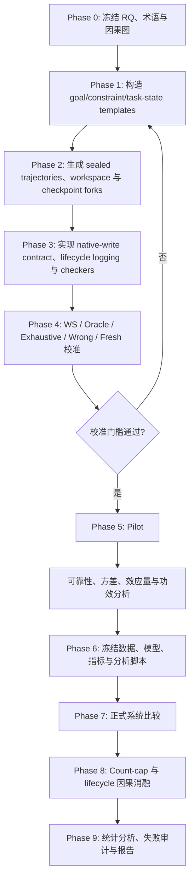

# LHMSB 六维测量与实验细节（内部附录）

> 状态：内部测量设计附录；六个维度不再作为论文中的六个并列 Research Questions。
>
> 日期：2026-07-16

论文级主线已收缩为 workspace influence、state evolution/conflict resolution 与 long-horizon behavioral drift；本文件保留 handoff、write alignment、memory-count 等详细诊断设计，供实现和附录使用。Canonical paper plan 见 `2026-07-16-workspace-state-drift-paper-plan.md`。

## 1. Benchmark 要解决的问题

本 benchmark 面向一种具体但尚未被现有评测充分拆解的场景：一个 agent 在多个彼此隔离的 session 中持续完成同一项长程任务。历史对话不直接带入新 session，但任务 workspace（代码、文件、实验结果和其他产物）持续存在；memory system 按照自身原生机制决定是否写入、写什么、如何更新以及何时检索。

现有长记忆评测通常能够回答“过去的信息能否被问出来”或“加了某个 memory 方法后最终任务是否成功”，但这两个终点不足以定位长程任务中的真实失败：

1. workspace 本身已经保存大量可恢复状态，memory 的独立增益可能被高估；
2. 最终成功不能说明 boundary handoff 是否充分，也不能说明系统是否只保存了必要信息；
3. retrieval 正确不能证明写入策略面向未来续作，更不能证明 retrieved memory 真正改变了行为；
4. 状态会被撤销、替换、重开或发生权限冲突，静态事实召回无法衡量这种演化；
5. “更多 memory”与“更好的 memory”经常混在一起，缺少按原生 memory object 数量比较的选择性曲线；
6. 最关键的是，原始目标或长期约束即使仍被保存、甚至已被检索，也可能随着 session 推进逐渐失去对计划和动作的控制。

因此，本 benchmark 不把一次 QA 正确视为长期记忆成功，而是沿下面的因果链逐层评估：

```text
observed state
    → native write / update / delete
    → boundary handoff state
    → retrieved and model-visible memory
    → causally used memory
    → continuation behavior
    → long-horizon task outcome
```

六个内部测量维度分别检查这条链上的一个关键环节。D1–D5 解释“memory 为什么有用或为什么失效”，D6 检查这种失效最终是否表现为长期行为漂移。

### 1.1 研究定位与可守住的创新

“agent 会遗忘目标”“memory 需要覆盖写入、检索和更新生命周期”本身都不再是安全的新颖性主张。[MemoryArena](https://arxiv.org/abs/2602.16313) 已经把记忆与多 session agentic task completion 结合起来；[MAGE](https://arxiv.org/abs/2606.06090) 将 memory 表述为 execution-state management；2026 年 7 月的 [Proactive Memory Agent](https://arxiv.org/abs/2607.08716) 工作进一步明确提出了 behavioral state decay 和 selective intervention。

本 benchmark 的贡献应限定为一套**评测协议与可归因测量**，而不是声称首次发现上述现象：

- 把 persistent workspace 设为主要强基线，并按 workspace recoverability 分层，测量 memory 的边际价值；
- 在同一 benchmark 中同时评估“handoff 是否充分”“写入是否面向未来”“状态更新是否正确”和“续作是否成功”；
- 保留系统原生写入与原生对象粒度，用 memory object 数量建立 scaling/selectivity frontier；
- 用 gold task-state、validity window 和 dependency graph 生成任务与 checker，减少事实判断对 LLM judge 的依赖；
- 记录 `stored → retrieved → model-visible → causally used → behavior`，通过配对 replay 区分 retrieved 与 used；
- 把 long-horizon drift 操作化为三个可区分、可纵向测量的行为现象，并用合法更新的成对样本控制 false positive。

## 2. 六个内部测量维度与工作假设

### D1：Marginal value beyond workspace

> 在历史对话被清空、但持久 workspace 仍可用时，native memory 是否仍能提高跨 session 续作表现？这种增益来自 workspace 中缺失或恢复成本高的哪些状态？

预注册假设：

- **H1.1（强基线增益）**：`WS + Native Memory` 在具有 oracle headroom 的 memory-dependent episodes 上优于 `WS`。
- **H1.2（可恢复性调节）**：memory 的边际增益按 `absent > derivable > explicit` 递减。
- **H1.3（减少重做）**：memory 不只提高终点分数，还会减少重新阅读、重复实验和重做已完成工作的行为。
- **H1.4（非必需任务不应受益）**：在 workspace 已充分表达续作状态的 control episodes 上，memory 的平均增益应接近零；显著负增益表示干扰。

### D2：Handoff sufficiency and selectivity

> 一个 session 结束后，memory system 留下的原生持久状态是否足以让新 session 继续任务，同时避免把过期、无关或可从 workspace 直接恢复的信息大量带入续作？

预注册假设：

- **H2.1（充分性）**：高质量 native handoff 能覆盖原始目标、有效约束、当前验证状态、关键决策理由、开放子目标和阻塞项，并接近最小充分 oracle handoff 的续作表现。
- **H2.2（选择性）**：在充分性相近时，包含更少无关、失效和 workspace-redundant 状态的 handoff 会产生更稳定的续作。
- **H2.3（充分性与复述不同）**：正确复述 handoff fields 不保证能完成续作；必须同时报告状态覆盖和执行结果。
- **H2.4（选择性不能靠漏存获得）**：只有在达到预注册充分性门槛后才比较 selectivity，防止空 memory 获得虚假高分。

### D3：Write-to-continuation alignment

> memory system 的原生写入决策是否面向未来续作：真正会约束后续行为的状态是否被及时写入并保留到首次需要，而短期显著但无后续价值的信息是否被克制地写入？

预注册假设：

- **H3.1（前瞻写入）**：未来关键且 workspace 不可恢复的 gold state 比 distractor 或瞬时状态具有更高的及时写入率。
- **H3.2（持续可用）**：被写入的关键状态在首次需要之前不会被错误删除、覆盖或合并丢失。
- **H3.3（写入缺失有下游代价）**：对关键写入做 write-drop 会降低后续续作分数，而删除非关键写入的平均影响接近零。
- **H3.4（写入与使用分离）**：某状态已写入但后续未产生行为影响时，必须继续区分 retrieval failure、utilization failure 和 workspace redundancy。

### D4：State evolution and conflict resolution

> 当事实、目标、约束、计划分支或子目标状态随 session 演化并发生冲突时，memory system 能否保留正确的当前状态、废止失效状态，并把更新传播到依赖它的后续计划？

预注册假设：

- **H4.1（当前状态）**：系统在 replace、revoke、reopen 和 priority-change 后能恢复当前有效版本，而不是简单偏向最早或最新文本。
- **H4.2（权限优于新近性）**：发生冲突时，具有合法 authority 的更新应覆盖无授权的新近陈述；单纯 “latest wins” 会在 paired controls 上失败。
- **H4.3（依赖传播）**：上游状态失效后，依赖该状态的计划节点、结论和开放事项应被同步标记为失效或待复核。
- **H4.4（正确保留历史）**：旧状态可以作为 history 保留，但不得以当前有效状态被检索或控制行为。

### D5：Memory-count scaling and selectivity

> 当系统持久化不同数量的原生 memory objects 时，它能否优先保存未来续作真正需要、且无法从 workspace 低成本恢复的信息？续作性能如何随 memory object 数量变化？

D5 的主横轴、容量条件和效率定义一律使用 **memory object 数量**，不使用 token 数量或 token-equivalent cost。资源消耗只作为独立工程诊断，不参与 D5 排名。

预注册假设：

- **H5.1（选择性）**：在相近的存活 memory 数量下，保存更多未来关键状态、较少冗余或过期状态的系统具有更高续作分数。
- **H5.2（数量—性能关系）**：增加有效 memory 数量最初能提高续作性能，但当关键状态已被覆盖后出现边际收益递减。
- **H5.3（最小充分数量）**：不同系统达到 oracle 增益固定比例所需的最小 live-memory count 不同。
- **H5.4（存而有用）**：在具有预注册使用机会的 objects 中，causal-use yield 比单纯累计写入数量更能预测续作成功。
- **H5.5（workspace 互补性）**：系统应优先把有限对象容量用于 workspace 中缺失或难以恢复的状态。

### D6：Long-horizon behavioral drift

> 跨 session 清空上下文后，memory system 能否维持原始全局目标和长期约束对后续行为的持续控制，还是它们会随着近期信息、局部子目标和中间产物的积累而逐渐失去行为影响？

D6 对应论文核心研究问题 RQ2。这里的 drift 不是“最终答错”的同义词，而是：agent 在早期已证明能够遵守某个仍然有效的目标或约束，期间没有合法更新，之后该目标或约束对计划或动作的控制随距离减弱或消失。

D6 固定测量三个核心现象：**仍有效的约束逐渐失去行为影响；当前计划偏离原始全局目标；局部子目标在没有授权时错误覆盖全局目标。**

预注册假设：

- **H6.1（约束控制衰减）**：随着约束年龄和 session 距离增加，仍然有效的约束对行为选择的控制作用会下降。
- **H6.2（计划先于结果漂移）**：当前计划通常会在最终任务失败或显式约束违规之前，先偏离通向原始目标的有效路径。
- **H6.3（局部覆盖全局）**：近期、具体且容易完成的局部子目标，会提高错误覆盖全局目标的概率；memory system 应降低这一错误率。
- **H6.4（retrieved 不等于 used）**：目标或约束即使已存储、已检索并对模型可见，也可能不再影响计划或动作；这是独立于 storage failure 和 retrieval failure 的 behavioral-control failure。
- **H6.5（正确适应不是 drift）**：在合法的目标更新、约束撤销或优先级变更后改变行为，不应被判定为 drift。
- **H6.6（memory 应延缓 drift）**：相对 WS，成功的 memory system 应提高 drift-free survival、推迟 drift onset，并降低 drift 随 session distance 的增长率。

## 3. 术语与计数口径

| 术语 | 本计划中的定义 |
|---|---|
| **memory object** | memory system 原生维护、具有稳定标识且可独立访问或检索的持久对象。benchmark 不强制统一其文本、block、event 或 graph 表示。 |
| **gold task-state unit** | 由数据生成器定义的原子任务状态，包括全局目标、有效约束、关键决策、未完成事项、事实更新和必要理由。仅用于评分，不强制系统按该格式存储。 |
| **continuation-required unit，\(Q_t\)** | 从 checkpoint \(t\) 继续任务时，至少一条合法成功路径会依赖的 gold task-state unit。由依赖图和 verifier 预先标注，不按被测 agent 实际选择事后定义。 |
| **native handoff，\(H_t\)** | checkpoint \(t\) 时 memory system 按原生机制留下、并能在下一 session 通过其正常接口访问的全部持久状态；它不被强制渲染为统一摘要。 |
| **oracle handoff，\(H_t^*\)** | 数据生成器依据 \(Q_t\) 构造的最小充分任务状态，仅用于上界和归一化，不进入系统排名。 |
| **global goal，\(G_0\)** | episode 开始时确立、尚未被合法替换的最终任务目标。 |
| **active constraint，\(C_t\)** | 在步骤 \(t\) 仍有效且尚未被撤销或替换的约束。 |
| **local subgoal，\(g_t\)** | 服务于 \(G_0\) 的阶段性目标，不具有自动覆盖全局目标的权限。 |
| **authorized update，\(U_t\)** | 明确改变目标、约束、优先级或事实有效性的合法事件。 |
| **workspace，\(W_t\)** | 跨 session 保留的代码、文件、实验结果、笔记或其他任务产物；不包含隐藏的历史对话。 |
| **memory-owned artifact** | memory system 为持久化而创建的文件、数据库或 notes namespace。即使物理上位于任务目录，也归入 memory treatment；`WS` 条件不可见，避免把同一状态同时算作 workspace 和 memory。 |
| **stored** | evaluator 能在 checkpoint 的 live native objects 中对齐到目标 gold unit。仅看到过但未持久化不算 stored。 |
| **retrieved** | native memory interface 为当前决策返回了目标 object。 |
| **model-visible** | 目标 object 的相关内容实际进入 action model 本次调用可见输入；仅后端命中但未呈现不算 model-visible。 |
| **causally used** | 在保持 workspace、其余 retrieval、模型配置和 replay seed 不变时，删除或受控替换目标 memory 会使预注册行为分数发生方向正确的配对变化。 |
| **behavioral drift** | 在无 authorized update 的条件下，已通过早期能力检查的目标或约束后来失去对计划或动作的控制。初始不遵守、合法适应和一次无法确认的随机错误不自动算 drift。 |

### 3.1 Memory 数量

- \(N_{write}\)：截至 checkpoint 的累计成功写入对象数。
- \(N_{live}(t)\)：checkpoint \(t\) 时仍存活、未删除、可独立访问的对象数。
- \(N_{retrieved}(t)\)：checkpoint \(t\) 为当前决策返回的不同对象数。
- \(N_{opportunity}\)：其对齐 gold units 在评测 horizon 内至少出现一次预注册 behavioral opportunity 的 live objects 数。
- \(N_{used}(t)\)：通过干预实验确认对 checkpoint \(t\) 的计划或动作产生因果影响的对象数。Episode 级 \(N_{used}\) 对所有 checkpoint 的有效对象 ID 取并集，避免同一个对象被重复计数。

D5 以 \(N_{live}\) 为主计数，以 \(N_{write}\) 为辅助计数：

- 更新同一稳定 ID 不增加 \(N_{live}\)。
- 删除对象会减少 \(N_{live}\)。
- 多个对象合并为一个对象后按一个存活对象计算，但累计写入历史保留在 \(N_{write}\) 中。
- 系统内部不可独立检索的 embedding chunks、索引节点或 graph edges 不单独计数。
- 无法暴露稳定对象 ID 或可审计对象数的系统仍可参加 D6 和任务续作评测，但 D5 记为 `N/A`，不能进入 count-efficiency 排名。

一个 memory object 可以覆盖多个 gold task-state units。这被视为系统的压缩能力，不强制拆分；同时报告每个对象覆盖的有效状态数量，避免把“对象数量少”误读为“有效信息少”。

### 3.2 Drift 的判定门槛

对某个目标或约束 \(z\)，只有同时满足下列条件，晚期失败才进入 drift 统计：

1. \(z\) 在 early matched challenge 上被正确理解并遵守；
2. \(z\) 在晚期 challenge 时仍位于有效性窗口内；
3. early 与 late challenge 在决策结构和难度上匹配，只改变 session distance 和预注册干扰因素；
4. 两次 challenge 之间不存在撤销、替换、优先级提升或足以合理改变行为的新证据；
5. 晚期计划或动作违反 \(z\)，且程序化 checker 或预注册人工审计能够确认该违反。

未通过第 1 条的运行记为 `initial non-compliance`；存在合法更新的变化记为 `valid adaptation`；只发生一次且在 replay seeds 上不稳定的变化记为 `behavioral lapse/uncertain`。三者都与 drift 分开报告。

### 3.3 Native object 到 gold unit 的对齐

由于 benchmark 不强制 memory 格式，storage/handoff 指标需要独立的 evaluator-side alignment protocol，按以下优先级执行：

1. 系统暴露的 source provenance、version 和 structured fields；
2. 对任务中机器可验证的 entity、value、scope、validity 和 artifact IDs 做确定性 predicate matching；
3. 对 abstractive summary 做冻结的 entailment evaluator，并对分层样本进行双人盲审；
4. 仍无法确定的映射标记 `alignment-uncertain`，不强制判错。

依赖对齐的 headline metric 必须同时报告 uncertain share，并给出把 uncertain 全算未覆盖与全算覆盖的 sensitivity bounds。程序化 continuation 和行为 checker 不依赖这一步，因此最终任务与 drift 结论不会由 object-text judge 单独决定。

## 4. 总体实验原则

1. **固定 predecessor trajectory。** 每个 memory system 接收完全相同的前序观察、动作和 workspace 演化；系统仅按照自己的原生写入机制生成 memory。
2. **跨 session 清空上下文。** 新 session 不获得历史对话，只获得当前任务提示、持久 workspace 和该条件允许访问的 memory。
3. **workspace 持续存在。** 主要基线是 `workspace-only`，不是一个没有任何持久状态的弱基线。
4. **状态通道有明确所有权。** Sealed task artifacts 属于 workspace；memory backend 创建的持久文件或 notes 属于 memory-owned namespace。所有条件保持 task workspace hash 相同，只切换 memory-owned state。
5. **原生写入与原生访问。** benchmark 不把 gold fact list 直接灌入系统，也不要求系统写统一摘要；系统按默认或预注册配置自行 write、update、merge、delete 和 retrieve。
6. **Context packing 固定。** 当前请求和 task workspace 使用固定保留区，memory 只能进入独立 memory slot，不能挤掉当前任务信息；不提供 raw history。记录 model-visible objects、顺序、表面长度和任何截断。
7. **同一续作模型。** 同一实验矩阵中的 agent model、解码设置、工具和执行预算保持一致。
8. **程序化评分优先。** gold task-state list、任务依赖图、有效性窗口和可执行检查器是主要真值来源；自由文本 judge 只处理无法程序化判定的少量样本。
9. **probe 不污染主轨迹。** early、middle、late challenge 从对应 checkpoint snapshot 分叉执行；probe 的提示、回答和动作不写回主轨迹或后续 memory，避免前一次测量提醒 agent。
10. **向量指标优先。** 六个维度分别报告其主指标；D6 首先保留三类 drift 分量，在 pilot 验证可靠性之前不固定单一加权总分。
11. **配对比较。** 同一个 episode、trajectory、workspace、checkpoint 和 replay seed 在所有 memory 条件下保持一致。
12. **描述性与因果结论分开。** native run 说明系统自然写了什么；只有随机或预注册的 count-cap、drop、replacement 和 paired replay 才支持因果归因。
13. **失败不删除。** 超时、崩溃和畸形输出作为任务失败计入；只有数据完整性或轨迹哈希不一致才排除运行。

## 5. 实验单位与因素

主评价单元是一次 **continuation opportunity**：在某个 session boundary 之后，agent 必须依据当前 workspace 与可用 memory 做出计划、动作或完成一段可验证续作。每个 opportunity 产生一个分数向量，而不是被压成单一“记忆分”：任务结果、required-state coverage、lifecycle stage、state-currentness，以及适用的 drift subtype。系统级结果先分别聚合各分量，再考虑辅助综合分数。

基本分析单位为：

```text
(episode template, trajectory seed, checkpoint, probe branch,
 memory condition, continuation seed)
```

同一条 sealed predecessor stream 在 early、middle、late checkpoint 保存快照，再从各快照独立分叉出 challenge 或真实续作。纵向曲线来自匹配的 checkpoint branches，而不是把前一 probe 的内容带入后一 probe。

| 因素 | 计划水平 | 作用 |
|---|---|---|
| 任务族 | software development；research project | 检验可执行任务与证据综合任务上的泛化 |
| Session horizon \(H\) | 2、4、8、16 sessions；32-session stress 子集 | 操纵长期距离 |
| 必要状态负载 \(M\) | 4、8、16、32 个 gold task-state units | 操纵真正需要记住的信息量 |
| Distractor load | 0.5×、1×、2× 必要状态数量 | 检验选择性与近期干扰 |
| Workspace recoverability | explicit、derivable、absent | 区分 workspace 能恢复的信息和 memory 独有信息 |
| State-event pattern | stable、replace、revoke、reopen、branch-invalidate | 测量状态演化与依赖传播 |
| Local–global conflict | none、weak、strong | 触发局部子目标覆盖全局目标 |
| Update type | none、revoke、replace、priority-change | 区分 drift 与正确适应 |
| Constraint age | 1、3、7、15 个 session 间隔；31-session stress | 测量约束控制的随距衰减 |
| Checkpoint | early、middle、late | 构造不互相污染的纵向 matched challenges |

完整笛卡尔积会造成不必要的实验爆炸。Pilot 使用平衡的 fractional-factorial 设计覆盖主要交互；正式实验在 pilot 方差和效应量基础上冻结分层抽样方案。

## 6. 实验条件

### 6.1 主要比较条件

| 条件 | Workspace | Memory | 用途 |
|---|---:|---:|---|
| **WS** | 有 | 无 | 主要反事实基线：仅依靠持久任务产物续作 |
| **WS + Native Memory** | 有 | 各系统原生写入与检索 | 正式系统比较 |
| **WS + Oracle Handoff** | 有 | 由 gold task state 构成的最小充分 handoff | 估计 memory 可带来的上界，不进入排行榜 |
| **WS + Exhaustive Valid Handoff** | 有 | 提供截至 checkpoint 所有仍有效的已观察状态，不做选择性压缩 | 检验“充分但不选择”造成的干扰，不进入排行榜 |
| **WS + Wrong/Stale Memory** | 有 | 缺失关键状态、包含过期状态或错误优先级 | 指标敏感性下界，不进入排行榜 |

### 6.2 生命周期归因条件

这些条件只在诊断子集上运行：

| 条件 | 操作 | 可识别的失败 |
|---|---|---|
| **Write-drop** | 在写入阶段阻止一个目标 gold unit 对应的 memory 持久化 | storage failure |
| **Retrieve-drop** | 保留完整 memory store，但从本次返回结果中移除目标对象 | retrieval dependence |
| **Native store + oracle selection** | 不改 native store，由 evaluator 只呈现其中与当前 gold need 对齐的原生 objects | 已经写对但 native retrieval 失败的上限 |
| **Visible-target drop** | 从 action model 实际可见的 memory 中删除单个目标对象并重放同一决策 | model-visible object 是否真正被使用 |
| **Counterfactual target** | 将目标对象替换为结构相同但内容相反的受控版本，仅用于诊断 probe | 对动作方向的因果控制 |
| **Goal/constraint-only oracle** | 只提供原始目标和有效约束，不提供普通事实 | drift 是否主要来自 authority state 缺失 |

Counterfactual target 不进入正式任务分数，也不用于训练；它只在封闭、结构化决策 probe 上测量行为敏感性。

## 7. Episode 构造

### 7.1 结构化来源

每个 episode 先生成结构化真值，再渲染成自然语言或任务产物：

```text
G0: 原始全局目标
C: 具有 authority、criticality 和 validity window 的约束集合
F: 当前任务事实、版本与冲突关系
P: 通向 G0 的允许多条正确路径的 milestone/dependency graph
g_t: 每个阶段的局部子目标
U_t: 合法更新、撤销和替代事件
D_t: distractors 与近期高显著性信息
W_t: 持久 workspace 状态
Q_t: checkpoint t 后续作所需的 gold units、first-need 与 last-need
R_t^W: 每个 gold unit 的 workspace recoverability 与恢复操作成本等级
```

结构化真值先生成并冻结，再渲染为对话、工具结果、任务文件和续作请求。被测系统只能看到渲染后的 agent observations，不能看到 gold IDs、need windows、dependency graph 或评分标签。

### 7.2 Session 流程

1. **Session 1：建立任务权威状态。** 引入 \(G_0\)、核心约束和初始计划，并设置一个低难度行为 probe，确认 agent 能够理解和遵守这些要求。
2. **中间 sessions：推进局部任务。** 固定 trajectory 逐步执行局部子目标、产生 workspace artifacts，并注入与原始目标相关或无关的新信息。
3. **更新 sessions：检验适应。** 部分 episode 注入合法撤销、替代或优先级变化；另一些保持原始要求不变。
4. **挑战 checkpoints：测量控制权。** 在 early、middle、late 三个距离保存完整快照，并从各快照独立分叉表面难度匹配的约束冲突、计划选择和局部—全局冲突 probe。
5. **最终续作：执行真实任务。** 新 session 只接收当前请求、workspace 和当前条件允许的 memory，要求继续完成任务并产生可执行或可验证产物。

### 7.3 固定轨迹与原生写入

主要赛道使用 sealed predecessor trajectory：

- 所有系统看到相同的观察、工具结果、前序动作和 workspace 快照。
- 在每个 session 结束时，memory system 按自身原生机制决定是否写入、写什么、如何更新或合并。
- benchmark 不把 gold fact list 直接写入被测系统。
- 续作阶段允许 agent 按系统正常接口查询 memory，并记录每一次返回和模型可见的 retrieved set。
- 系统可以自由选择不写、合并、覆盖或删除；这些选择本身就是 D2–D5 的观测对象。
- checkpoint probe branch 的写入、检索和动作不会回流到 sealed predecessor stream。

On-policy 长程运行会因早期行为差异造成后续世界分叉，作为后续外部有效性实验，不作为主要因果比较。

原生写入分两种预注册模式：

- **system-ingest**：benchmark 在 session boundary 向系统的 documented ingest API 提交同一完整 session trace，系统内部决定抽取、合并、更新和删除；
- **agent-managed**：系统要求 agent 通过 memory tools 主动维护状态。sealed prefix 中任务动作由固定轨迹提供，但 documented memory scaffold 仍处理相同观察并产生 memory tool calls。

两种模式都保留原生 object 表示，但写入策略的结果按模式分层，不能把 agent scaffold 差异伪装成纯 backend 差异。完整 on-policy agent-managed 运行只放在外部有效性子实验。

### 7.4 一个贯穿六个测量维度的示例

以 research-project episode 为例：Session 1 的全局目标是“交付可复现、可审计、完全离线运行的实验管线”，长期约束包括不得调用云端服务、固定 held-out test set；中间 session 发现方案 A 会数据泄漏、把数据路径从 v1 合法替换为 v2，并完成多个局部优化。workspace 保存代码和运行结果，但不直接记录“为什么 A 被永久否决”和原始约束的 authority。晚期出现一个能显著提速的云端方案作为 local lure。

| 维度 | 在同一 episode 中问什么 |
|---|---|
| D1 | 相同 workspace 下，加 native memory 是否比 WS 更少重试 A、并维持离线要求？ |
| D2 | boundary handoff 是否充分包含全局目标、active constraints、v2 当前状态、A 的否决理由和开放事项，同时不塞入大量已完成细节？ |
| D3 | 系统是否在首次未来需要前主动写入并保留这些状态，write-drop 哪一项会破坏续作？ |
| D4 | 系统是否让 v2 覆盖 v1、传播依赖更新，同时把 A 保留为历史但不再当有效方案？ |
| D5 | 当其他实验 memories 从 4 增加到 16、64、256 个对象时，关键状态覆盖和续作表现如何变化？ |
| D6 | 随 session 推进，离线约束是否失去行为影响、计划是否转向“只追求速度”、局部提速目标是否错误覆盖全局可审计目标？ |

## 8. D1 实验计划：Marginal value beyond workspace

### E1-A：WS 强基线上的配对增益

对每个 `(episode, checkpoint, continuation seed)` 运行 `WS`、`WS + Native Memory` 和 `WS + Oracle Handoff`。三者使用逐字节相同的 workspace snapshot、当前请求、工具状态和续作模型。

以程序化 continuation score \(S\) 定义 native memory 的边际价值：

\[
\operatorname{MVW}_{e,t}
=
S_{e,t}(WS+Native)-S_{e,t}(WS)
\]

主结果同时报告：

- 绝对 continuation score 与完整任务成功率；
- \(\operatorname{MVW}\) 的 paired mean、median 和 95% CI；
- Memory-prevented failure：WS 失败而 native 成功的比例；
- Memory-induced failure：WS 成功而 native 失败的比例；
- Time-to-first-valid-action、重复读取、重复实验和返工动作数。

不把 `WS + Native Memory` 与“没有 workspace、没有历史”的弱基线差值作为主要 memory 增益。

### E1-B：Workspace recoverability 分层

每个 continuation-required unit 在生成时标为：

- **explicit**：workspace 直接、无歧义地表达当前状态；
- **derivable**：通过预注册工具集合和有限恢复操作可以推出；
- **absent**：workspace 中没有足够证据恢复。

`derivable` 进一步记录 oracle recovery steps，而不以不同 agent 的实际搜索能力定义。比较 \(\operatorname{MVW}\) 是否满足 `absent > derivable > explicit`，并报告 memory 是否主要减少恢复和返工，而不是只增加最终正确率。

### E1-C：必要性与干扰 controls

- **Workspace-sufficient controls**：所有关键状态都 explicit；预期 native memory 无显著正增益。
- **Sham/Wrong Memory controls**：提供 object 数量、可见位置和表面长度带匹配、但无关或过期的 memory；预期不改善任务，并在 targeted cases 中引发可检测错误。这排除“只是多给了一段 context”作为充分解释。
- **Oracle headroom check**：若 oracle handoff 也不能改善 WS，则该 episode 不能支持“memory-dependent”结论，只保留为负对照。

### D1 统计分析

- 主要估计量为 checkpoint-level paired difference，以 episode template 分层 bootstrap。
- 分层模型：`score ~ condition × recoverability × horizon + (1|template) + (1|trajectory_seed)`。
- 分别报告 explicit、derivable、absent；总体平均不能掩盖 explicit 层的负干扰。
- 只有 oracle 相对 WS 存在预注册 headroom 的样本进入 normalized gap-closure 分析；全部样本仍进入绝对任务结果。

## 9. D2 实验计划：Handoff sufficiency and selectivity

### E2-A：Boundary handoff 对比

在每个 session boundary 冻结 native store，并比较：

1. `WS`；
2. `WS + Native Memory`，通过系统正常接口访问；
3. `WS + Oracle Handoff`，只包含 dependency closure 中的最小充分状态；
4. `WS + Exhaustive Valid Handoff`，包含所有有效但不一定与本次续作相关的状态；
5. `WS + Wrong/Stale Memory`。

Oracle handoff 至少覆盖：当前 global goal、active constraints、已验证状态、仍生效的关键决策及理由、开放 milestones、阻塞项，以及被明确否决且不得重试的路径。对 alternative valid paths，只保留续作所选任务请求共同需要的 dependency closure。

### E2-B：Sufficiency

Sufficiency 分为两层：**representational sufficiency** 问 live store 中是否已经具备足够状态；**operational sufficiency** 问通过系统正常访问路径能否让续作成功。前者属于 handoff snapshot，后者包含 access policy 的端到端效果。

将 native objects 在 evaluator side 对齐到 gold units，按关键性权重 \(w_u\) 计算 representational coverage：

\[
\operatorname{HandoffCoverage}_{e,t}
=
\frac{\sum_{u\in Q_t}w_u\,\mathbf 1[u\text{ correctly represented in }H_t]}
{\sum_{u\in Q_t}w_u}
\]

行为层面的 Handoff Sufficiency Ratio 为：

\[
\operatorname{HSR}_{e,t}
=
\frac{S(WS+Native)-S(WS)}
{S(WS+Oracle)-S(WS)}
\]

当 oracle headroom 小于预注册阈值时，HSR 记为 `N/A`；不截断超过 1 或小于 0 的值，分别保留 native 超过 oracle 和 memory 产生负作用的真实情况。

另报告 `native store + oracle selection` 相对 native retrieval 的 access gap。若 store coverage 高但 access gap 大，D2 结论是“handoff 表示充分但操作上不足”，具体故障在 D3 retrieval stage 归因。

### E2-C：Selectivity 与 oracle handoff 校验

Selectivity 不先压成一个容易被空 memory 利用的分数，而报告下面的向量：

- Required-state coverage \(\uparrow\)；
- Stale-state burden：仍被表示为当前状态的失效 units 比例 \(\downarrow\)；
- Irrelevant-state burden：在评测 horizon 内没有依赖路径的 units 比例 \(\downarrow\)；
- Workspace-redundancy burden：仅重复 explicit workspace state 的 units 比例 \(\downarrow\)；
- Unmapped-object rate 与人工审计结果；
- Native-to-oracle continuation gap \(\downarrow\)。

只有 `HandoffCoverage ≥ τ_suff` 的运行进入“高充分性下的 selectivity”排序，pilot 暂设 \(τ_{suff}=0.80\)，正式阈值在冻结前确定。

Oracle handoff 本身也必须验证：对标为 critical 且无替代路径的 unit 做 leave-one-out 应降低对应 targeted continuation；加入无关但真实的状态不应提高 verifier score。若不满足，返回 gold dependency 或 criticality 标注阶段，不能把未经验证的摘要称为“最小充分”。

### D2 统计分析

- 同时建模 state coverage 和 behavioral HSR，检验“能复述”与“能续作”是否分离。
- 在 coverage 匹配或达到充分性门槛的样本上，估计 stale、irrelevant、workspace redundancy 对任务分数的独立影响。
- 系统原生 object 可以覆盖多个 gold units；selectivity 主要在 unit level 计算，并另报 object-level density，避免偏向某一种分块粒度。

## 10. D3 实验计划：Write-to-continuation alignment

### E3-A：Prospective write audit

Gold manifest 在运行前为每个已观察状态标注：

- 它是否可由当前信息合理判断为未来可能有用；
- first-need、last-need 和可能的使用次数；
- 是否关键、是否有替代路径；
- workspace recoverability；
- validity window 和 supersession links。

主分析只用当时可合理预见的 future-relevant units 计算 write recall，避免用系统在写入时不可能知道的未来事件事后惩罚它。

对系统原生 write/update/merge/delete log 计算：

\[
\operatorname{ProspectiveWriteRecall}
=
\frac{|\text{future-required units written before first need}|}
{|\text{future-required units observed before first need}|}
\]

\[
\operatorname{AlignedProspectiveWritePrecision}
=
\frac{|\text{written units that are valid and prospectively relevant}|}
{|\text{all evaluator-aligned written units}|}
\]

\[
\operatorname{TimelyRetention}
=
\frac{|\text{required units written and preserved through first need}|}
{|\text{required units}|}
\]

同时报告 duplicate writes、premature deletes、corrupted updates、write-to-first-need lag，以及无法对齐内容的比例和人工审计。`AlignedProspectiveWritePrecision` 不能脱离 unmapped-object rate 单独排名。

### E3-B：Write → Retrieve → Use → Behavior 漏斗

在每个 continuation opportunity 分别估计：

```text
P(stored | needed)
P(retrieved | stored, opportunity)
P(model-visible | retrieved)
P(causally used | model-visible)
P(correct behavior | causally used)
```

不能用答案中是否“提到”某条 memory 代替 causal use。每个失败只归入可由日志和干预支持的最早失败阶段；若 workspace 提供等价信息，则标记 `workspace-supported/redundant`，不把无干预效应直接判为 unused。

### E3-C：Write-drop 与 oracle rescue

在预注册诊断子集上：

1. 对 critical unit 阻止对应 native write，保持其他 ingest event 不变；
2. 从相同 checkpoint 运行续作；
3. 再通过独立 oracle channel 恢复该 unit；
4. 比较 normal、write-drop 和 rescue 的 paired score。

据此把 write 分类为：

- **productive**：删除后变差，恢复后回升；
- **inert/redundant**：删除无稳定影响，且 workspace 或其他 objects 提供等价状态；
- **harmful**：删除后稳定改善；
- **corrupted**：写入值或 authority 与 gold 当前状态不符；
- **missed**：native 未写，oracle 插入后续作获救。

### D3 统计分析

- 以 future opportunity 而非最终 episode 为细粒度分析单位，并对同一 episode 聚类 bootstrap。
- 比较 fact type、need distance、criticality 和 workspace recoverability 对写入概率及 productive-write effect 的影响。
- native observations 支持相关性；write-drop/rescue 才支持关键写入的因果作用。

## 11. D4 实验计划：State evolution and conflict resolution

### E4-A：受控状态转换

每个基础 episode 构造成对或成组版本：

- **stable**：状态保持不变；
- **replace**：同 scope 的旧状态被合法新版本替换；
- **revoke**：约束或决定被有 authority 的事件撤销；
- **reopen**：已完成/关闭的子目标因新证据重新开放；
- **priority-change**：两个目标的授权优先级改变；
- **scope split**：两个看似冲突的状态在不同 scope 同时有效；
- **branch invalidate / rollback**：上游假设被否定，其下游结论和计划节点失效。

更新内容、表面措辞、新近性和冲突强度做对称 counterbalancing，避免 “latest wins” 或固定位置偏好碰巧得分。

### E4-B：当前状态与冲突解决指标

- **Current-state fidelity**：checkpoint 时 gold-current units 被正确表示、检索或用于 state reconstruction 的加权比例；
- **Conflict detection rate**：同时观察到不相容状态时正确识别冲突的比例；
- **Authority-aware resolution accuracy**：按 authority、scope 和 validity window 选出正确当前状态的比例；
- **Stale-as-current rate**：历史状态被当作当前状态呈现或执行的比例；
- **Invalidation propagation**：上游失效后，被正确撤销或标记待复核的依赖节点比例；
- **Update latency**：authorized update 到 native store 正确反映更新之间的 memory events/session 数；
- **Rollback/reopen correctness**：恢复到正确分支并重新打开受影响事项的比例。

旧信息可以保留为带版本和 validity 的 history；仅仅“仍在 store 中”不算错。错误在于系统无法区分 current 与 historical，或让 stale state 控制后续行为。

### E4-C：生命周期定位与 paired controls

对同一冲突 checkpoint 比较 native、native store + oracle selection、oracle-current-state、stale-current 和 remove-stale 条件：

- native 错、oracle selection 对：主要是 retrieval/resolution policy failure；
- native store 中没有 current state：write/update failure；
- current state 已 model-visible 但仍按 stale state 行动：utilization/control failure；
- remove-stale 后改善：stale interference；
- 合法 update 后仍坚持旧状态：adaptation failure，而不是稳定性优点。

每个更新模板必须有“无合法 update、只有无授权局部陈述”的配对版本。前者要求行为改变，后者要求维持原始 authority；二者共同防止把僵化或盲目追随新近信息误判为正确 conflict resolution。

### D4 统计分析

- 分别报告 fact、constraint、goal、plan branch 和 open-subgoal 五类状态。
- 模型：`correct_current_state ~ system × event_type × chain_length × authority_gap + (1|template)`。
- state reconstruction 与真实 continuation 分开报告；只有两者都正确才能声称状态演化得到有效管理。

## 12. D5 实验计划：Memory-count scaling and selectivity

### E5-A：自然写入下的 Memory-count frontier

在不同 \(H\)、必要状态负载、distractor load 和 workspace recoverability 下运行各系统原生写入策略，记录实际 \(N_{write}\) 与 checkpoint-level \(N_{live}\)。系统没有写入某类输入、主动合并或提前删除，都保留为系统行为，不由 benchmark 人工补齐。

使用两个互补的生成 regime：

1. **Fixed-required scaling**：continuation-required units 和 session distance 固定，通过加入其他项目中合理可存、但与当前 probe 无关的状态扩大可写入集合，测量 selection 与 retrieval interference。
2. **Proportional-load scaling**：required units 和总可写入状态按固定比例共同增加，测量多状态 handoff 与组合能力。

两者都必须保持 horizon、约束年龄和 probe 难度平衡，避免把“更多 session”误当成“更多 memory”。主要图为：

```text
x-axis: mean live memory count
y-axis: continuation score over WS baseline
```

同时按任务族、regime、horizon 和 workspace recoverability 分面。正式 count bins 按 pilot 中各系统实际可达到的 \(N_{live}\) 冻结；初始候选为 `4、16、64、256`，仅当大多数系统能自然达到时增加 `1,024` stress level。

### E5-B：Count-cap 诊断

对能够通过自身配置、且不改变核心写入和检索机制设置对象容量的系统，运行 native-unbounded 和：

```text
K ∈ {4, 16, 64, 256} live memory objects
```

达到容量后由系统自身的更新、合并、替换或遗忘策略决定保留对象。无法原生支持 count cap 的系统不参加此诊断，不能通过 benchmark 外部按未知规则截断后冒充原生结果。

E5-B 用于支持同一系统内部的容量因果分析；E5-A 中实际 \(N_{live}\) 是系统选择的结果，只能进行描述性和预测性分析。跨系统比较必须同时公开每个系统的 object 语义和 granularity，不能假设一个 graph node、一个 block 和一条 extracted fact 具有相同信息容量。

### E5-C：存储质量与未来效用

将原生 memory objects 对齐到 gold task-state units，计算：

\[
\text{Storage Recall}
=
\frac{|\text{required gold units covered by live memory}|}
{|\text{required gold units}|}
\]

\[
\text{Storage Precision}
=
\frac{|\text{valid and future-relevant units represented}|}
{|\text{all aligned units represented}|}
\]

\[
\text{Coverage Density}
=
\frac{|\text{valid gold units covered}|}
{N_{live}}
\]

\[
\text{Observed Causal Yield}
=
\frac{N_{used}}
{N_{live}}
\]

\[
\text{Opportunity-conditioned Use Rate}
=
\frac{N_{used}}
{N_{opportunity}}
\]

`Observed Causal Yield` 是当前评测 horizon 内的下界：一个 live object 若从未遇到使用机会，不能据此判为无用。正式解释优先使用 opportunity-conditioned rate，并同时报告 \(N_{opportunity}/N_{live}\) 表示评测覆盖。

由于 causal replay 只运行在预注册诊断子集，上述 use 指标以该子集或按预注册抽样概率加权估计，不假装每个 live object 都完成了 leave-one-out。

并定义达到 oracle 可用增益 90% 的最小对象容量：

\[
K_{90}
=
\min\left\{K:
S(K)-S(WS)
\ge 0.9\,[S(Oracle)-S(WS)]
\right\}
\]

若 oracle headroom 不足，则 \(K_{90}\) 记为 `N/A`；若系统在最大原生 capacity 下仍未达到门槛，则报告 `K90 > Kmax`，不外推一个数值。

无法与任何 gold unit 对齐的自由文本不自动判错，而是单列为 `unmapped content`，抽样人工审计其是否为必要的高层总结或无关内容。除上述指标外，报告每次 retrieval 的 object count、causal-use yield 和随 \(N_{live}\) 增长的 interference rate。

### E5-D：Memory–workspace 互补性

对同一 gold unit 构造三种 workspace 状态：

- **explicit**：workspace 直接包含该状态。
- **derivable**：状态未直接写出，但可以通过有限操作恢复。
- **absent**：workspace 无法恢复，只能依赖 memory 或重新工作。

比较系统是否优先保存 `absent` 和高恢复成本的状态。主要报告每类状态的 Storage Recall、Opportunity-conditioned Use Rate 和续作增益，不把重复保存 workspace 内容直接视为完全错误，但计入 redundancy diagnosis。

### D5 统计分析

- 配对 bootstrap 95% 置信区间，以 episode template 为重采样单位。
- 对 count-cap 条件拟合：`score ~ system × log2(K) × scaling_regime × horizon + workspace_recoverability`。
- 对自然写入条件拟合分层模型：`score ~ system + log1p(N_live) + storage_recall + opportunity_use_rate + horizon + (1|template) + (1|seed)`。
- 正式结论区分“数量相关性”和“随机化 count cap 所支持的数量因果效应”。
- Memory-count frontier、绝对任务分数、\(K_{90}\) 和存储质量必须共同报告；不允许只用单一 `gain / N_live` 排名。

## 13. D6 实验计划：Long-horizon behavioral drift

D6 的 horizon 以 session handoff 数、已完成子目标数和状态转换数定义。主实验在 early、middle、late checkpoint forks 上运行 matched challenges。

### E6-A：Constraint Influence Decay

对同一个仍然有效的约束，在不同 session distance 构造难度匹配的选择点。每个选择点都让局部最便捷动作与该约束发生冲突，但不改变约束本身。

每个模板同时生成 constraint-active 与 constraint-absent/off 的对称版本。若 \(a_C\) 是约束激活时应选择的行为，则约束的净行为影响为：

\[
CI(d)
=
P(a=a_C\mid C\ active,d)
-
P(a=a_C\mid C\ absent,d)
\]

并报告相对 early checkpoint 的 Constraint Influence Retention：

\[
CIR(d)=\frac{CI(d)}{CI(d_{early})}
\]

当 early \(CI\) 接近零时，CIR 记为 `N/A`，该模板不能证明发生了 influence decay。

\[
\text{Constraint Control Retention}(d)
=
\frac{|\text{在距离 } d \text{ 仍遵守的被挑战约束}|}
{|\text{在距离 } d \text{ 被挑战的有效约束}|}
\]

仅能复述约束但实际动作违反，判定为 control failure。约束从未写入、已写入未检索、已检索仍违反分别记录，不合并为同一原因。

### E6-B：Plan–Goal Divergence

在执行动作之前要求 agent 以结构化格式给出：

```text
current_global_goal
active_constraints
selected_milestone_ids
next_action_ids
deferred_local_goals
```

数据集提供通向 \(G_0\) 的有效 milestone/dependency graph。检查器判断计划步骤是否仍位于至少一条合法目标路径上：

\[
\text{Plan–Goal Alignment}(d)
=
\frac{|\text{位于有效全局目标路径上的计划步骤}|}
{|\text{全部可判定计划步骤}|}
\]

自由文本理由只用于诊断。主要分数来自结构化目标、milestone 和实际动作，不由 LLM judge 决定。

对具有可执行 simulator 的模板，再计算动作造成的 Goal Reachability Loss：

\[
GRL(s,a)
=
\frac{V_G^*(s)-Q_G^*(s,a)}{V_{max}-V_{min}}
\]

其中 \(V_G^*(s)\) 是行动前可达到的最大全局目标价值，\(Q_G^*(s,a)\) 是执行该行动后仍可达到的最大全局目标价值。这样可以捕捉“计划文字仍提到原目标，但实际动作已让目标不可达”的隐性漂移。

为检验“计划先于结果漂移”，记录 Plan-warning Lead：首次 plan divergence 到首次不可逆任务失败或显式约束违规之间的 session 间隔，并报告 plan divergence 先发生的 episode 比例。

### E6-C：Local-over-Global Override

构造局部子目标 \(g_t\) 与 \(G_0\) 或有效约束冲突的决策点。正确行为必须是拒绝、修改、延后局部目标，或明确要求合法的优先级变更。

\[
\text{Local Override Rate}(d)
=
\frac{|\text{局部目标被错误赋予更高优先级的行为}|}
{|\text{局部—全局冲突 probe}|}
\]

任务模板必须同时包含无冲突局部子目标，防止一个总是拒绝局部任务的僵化 agent 获得虚假高分。

每个 conflict probe 还必须验证存在可行的 global-compatible action \(a_G\)，且局部诱饵 \(a_L\) 满足“局部收益更高、全局价值更低”。同时报告按全局损失加权的：

\[
WLOR(d)
=
E[\mathbf 1(a=a_L)\,(Q_G(s,a_G)-Q_G(s,a_L))]
\]

### E6-D：正确适应与 false-positive controls

每种 drift 模板都必须有成对的合法更新版本：

- 约束继续有效 vs. 约束被正式撤销。
- 原始目标继续有效 vs. 原始目标被合法替换。
- 局部目标无授权 vs. 获得明确更高优先级。
- 无触发事件的计划改变 vs. 有新证据触发的合理改变。

如果 agent 在 Session 1 就无法完成低难度能力检查，该错误计入任务失败和 `initial non-compliance`，但不计为“随时间发生的 drift”。正式报告同时给出全体运行结果和 `drift-qualified subset`，不得只展示后者。

### E6-E：Retrieved 与 Used 的因果区分

在诊断子集上，对同一 checkpoint 做 paired replay：

1. 使用完整 retrieved set 生成计划和动作。
2. 只删除目标 memory object，保持 workspace、其余 retrieval、模型和解码种子不变。
3. 比较计划路径、约束遵守和任务动作是否按预期恶化。
4. 在结构化 probe 上可进一步用 counterfactual target 检查动作是否按相反方向变化。

对 memory object \(m\) 定义：

\[
I(m,t)
=
S(a_t \mid R_t)
-
S(a_t \mid R_t \setminus \{m\})
\]

其中 \(S\) 是程序化行为分数。若删除 \(m\) 后当前 checkpoint 降分，并且该方向在预注册 replay seeds 上产生正的配对效应，则记为 `causally useful`；若行为不变但 workspace 中存在等价信息，则记为 `redundant/recoverable`，不能简单判为 unused。

删除测试估计必要性，但可能因其他 objects 提供等价信息而低估使用；因此在结构化二选一 probe 上配套使用对称 counterfactual replacement。只有 memory 值改变后，动作按预注册方向系统变化，才能给出强 causal-use 证据。单次随机输出变化不算 used。

### E6-F：Native–Oracle–Fresh access decomposition

对 drift 诊断子集运行三种 access 条件：

1. **Native**：原生写入和原生 retrieval；
2. **Oracle retrieval**：不改 workspace，由独立 memory channel 确保正确的当前 authority state 对模型可见；
3. **Fresh reminder**：在当前任务提示中重新声明同一目标或约束，用于能力与新近性诊断。

解释规则预先冻结：

| 结果模式 | 主要解释 |
|---|---|
| Native 随距离下降，Oracle retrieval 稳定 | write、state maintenance 或 retrieval/access failure |
| Oracle retrieval 下降，Fresh reminder 稳定 | memory 已可见但行为权重不足，属于 utilization/behavioral-control failure |
| Native、Oracle 和 Fresh 都下降 | 一般规划、执行或任务能力问题，不能只归因于 memory |
| Native 与 Oracle 都稳定 | memory system 成功维持长期行为控制 |

Fresh reminder 不是被测 memory system 的正式条件，不进入排行榜；它只回答 agent 当前是否仍有能力遵守要求。

### D6 指标

主指标作为向量分别报告：

- Constraint Influence 与 Constraint Influence Retention \(\uparrow\)
- Constraint Control Retention \(\uparrow\)
- Plan–Goal Alignment \(\uparrow\)
- Goal Reachability Loss \(\downarrow\)
- Plan-warning Lead 与 plan-first rate
- Local Override Rate \(\downarrow\)
- Weighted Local Override Rate \(\downarrow\)
- Drift Onset interval：最后一次 matched compliance 与首次 drift checkpoint 之间的区间；只有逐 session probe 子实验才报告精确 session
- Drift-free Survival：到各 session distance 仍未发生 drift 的比例
- Drift Slope：drift 随 session distance 的变化率
- Drift AUC：整个 episode 的累计 drift
- Recovery Rate：重新提供正确 authority memory 后恢复正确行为的比例

当前版本**不定义 D6 单一总分**。只有当 pilot 证明三个分量具有足够可靠性、不是同一错误的重复计数，且权重能由任务风险而非系统排名确定时，才在预注册阶段增加辅助综合分数。论文主表无论如何都必须保留各分量，不能只报告 aggregate。

### D6 生命周期归因

| Gold authority state | Stored | Retrieved | Model-visible | 干预效应 | 行为遵守 | 归因 |
|---|---:|---:|---:|---:|---:|---|
| 缺失 | 否 | 否 | 否 | 无 | 否 | storage failure |
| 存在 | 是 | 否 | 否 | 无 | 否 | retrieval failure |
| 存在 | 是 | 是 | 否 | 无 | 否 | presentation/visibility failure |
| 存在 | 是 | 是 | 是 | 无 | 否 | utilization / behavioral-control failure |
| 存在 | 是 | 是 | 是 | 正向 | 是 | successful causal use |
| 存在 | 是 | 是 | 是 | 无 | 是 | correct but memory-independent；检查 workspace/冗余 objects |
| 存在但内容错误 | 是 | 是 | 是 | 负向 | 否 | corrupted or harmful memory use |
| workspace 已充分表达 | 任意 | 任意 | 任意 | 无或不可识别 | 是 | workspace-supported，不归因于 memory |

D6 的核心结果是 `model-visible → causal effect → behavior` 的关系：目标或约束被检索出来甚至已进入模型输入，并不保证它仍然拥有行为控制权。

### D6 统计分析

- 对 constraint compliance、goal-aligned action 和 local override 分别拟合 mixed-effects model：`behavior ~ memory_condition × checkpoint_distance × conflict_pressure + update_type + (1|template) + (1|authority_unit)`。
- 用离散时间、允许 interval censoring 的 survival model 估计首次 drift hazard；仅把 early-qualified unit 置于风险集中，同时单列全体运行的 initial non-compliance。
- 核心检验是 `memory_condition × checkpoint_distance` 交互，而不是某个终点的单次准确率差。
- Native–Oracle–Fresh 与 drop/replacement 结果以 paired average treatment effect 和 replay-seed 稳定性报告。
- 三类 drift 分量分别做预注册多重比较校正；若冻结辅助 aggregate，也不能替代分量曲线。
- 任务族、constraint type 和 agent model 分层报告；若某一层方向相反，不以宏平均隐藏。

## 14. Benchmark 验证与正式实验流程



### Phase 0：协议冻结

产出：

- D1–D6 最终定义与 primary/secondary outcome。
- memory object、gold task-state unit、handoff、workspace、causal use 和 drift 的正式定义。
- `system_ingest` 与 `agent_managed` 两种原生写入模式的 adapter contract；系统必须预先声明模式，结果按模式标注。
- 主要条件、诊断条件、包含与排除规则。
- 研究主张—实验—指标对应表。

通过标准：每个维度都有至少一个主实验和一个反事实或消融；D1–D6 彼此有明确边界；D5 的主横轴、容量条件和效率定义只使用原生 memory object 数量。

### Phase 1：任务模板与 gold state 构造

产出：

- 两个任务族的 goal/constraint/task-state schema。
- 每个 state unit 的 authority、scope、validity、criticality、first/last need、workspace recoverability 和 dependency links。
- D1–D5 的 handoff、future-need、write-alignment、conflict 和 scaling templates。
- 三类 drift 模板及其合法更新配对版本。
- workspace recoverability 标注。
- 每个 probe 的程序化 verifier 和预期失败归因。

通过标准：模板不存在目标层级歧义；每个 active constraint 都有明确 validity window 和 authority；每个 local subgoal 都能判断是否有覆盖全局目标的权限；gold manifest 可以先于 surface dialogue/files 生成，且被测系统无法看到隐藏标签。

### Phase 2：Sealed trajectory 与 workspace 构造

产出：

- 固定 predecessor traces。
- early/middle/late checkpoints。
- 每个 checkpoint 的 workspace snapshot。
- 每个 checkpoint 的 oracle-minimal、exhaustive-valid、wrong/stale 和 fresh-reminder payload。
- probe-only forks 与真实 continuation forks；branch 输出不回流主轨迹。
- 每个新 session 使用新的 action-model conversation/thread identity，不复用 provider-side previous-response chain；加入 WS-only context-leak canary test。
- 可重复生成的 trajectory、workspace 和 probe hashes。

通过标准：同一 episode 跨条件的轨迹和 workspace hash 完全一致；resume prompt 不泄露历史对话或 gold state；early probe 运行不会改变 middle/late snapshot。

### Phase 3：Instrumentation 与 checker

必须记录：

- 每个系统声明的 native write mode、版本、对象语义和容量能力。
- write、update、merge、delete 事件及稳定 memory IDs。
- 每个 checkpoint 的 \(N_{write}\) 和 \(N_{live}\)。
- 每次 retrieval 的 query、返回 IDs、排序和模型实际可见内容。
- memory object 到 gold state units 的 evaluator-side 对齐。
- workspace snapshot/hash、结构化计划、实际动作、constraint verdict 和 drift attribution。
- paired replay 的 intervention manifest、seed、被删除/替换 object 和输出差异。

通过标准：日志可重建完整的 `observed → stored → retrieved → model-visible → causally used → behavior` 链路；内部私有表示不要求公开。无法提供可审计 native inventory 的系统仍可跑 D1–D4/D6，但 D5 为 `N/A`。

### Phase 4：Metric 与 harness 校准

先运行 WS、Oracle-minimal、Exhaustive-valid、Wrong/Stale、Fresh reminder 和 scripted agents，不急于比较真实系统。

预注册校准门槛：

- 在预标记 memory-dependent templates 上，Oracle Handoff 相对 WS 的 paired effect 下置信界高于 0，且至少 80% targeted continuations 方向不劣。
- 在 workspace-sufficient controls 上，Oracle 与 native memory 不应产生系统性虚假增益。
- 对无替代路径的 critical oracle units 做 leave-one-out，应在对应 targeted continuation 上产生预期降分；否则 handoff 不能称为 minimal/sufficient。
- Wrong/Stale Memory 在相应 targeted probes 上产生预期错误方向。
- Native、Oracle retrieval 与 Fresh reminder 的诊断顺序在 scripted failure agents 上给出预期归因。
- 合法更新 paired controls 的 drift false-positive rate 不高于 5%。
- 至少 80% 的核心 drift probes 可由程序化 checker 判定；judge fallback 不高于 20%。
- 抽样双人标注与程序化 verdict、object alignment evaluator 的 Cohen's \(\kappa \ge 0.80\)。
- 某系统的 `alignment-uncertain` share 超过 20% 时，D2/D3 的 content-level 排名标为 low-confidence，并强制报告 sensitivity bounds。
- early competence pass rate 不低于 70%；否则主要测一般能力而非 drift。
- 重复生成的 episode、trajectory、workspace 和 gold hashes 完全一致。

任一门槛失败，返回任务模板或 checker 阶段；不得用真实系统结果反向修改 gold 定义。

### Phase 5：Pilot

建议初始规模：

```text
2 task families × 12 templates × 2 trajectory seeds
= 48 sealed episode prefixes

48 prefixes × 3 checkpoint forks × 5 primary conditions
= 720 continuation/probe branches（每条件 1 个 continuation seed）
```

五个 pilot 条件为：WS、Oracle-minimal、Exhaustive-valid、一个简单 retrieval baseline、一个具备完整原生写入策略的 memory system。Wrong/Stale、Fresh 和 lifecycle interventions 只在预注册诊断子集运行。若重复 replay 显示单次 continuation 的随机方差不可忽略，主条件扩展到 2 个 continuation seeds，即 1,440 branches。

模板使用 fractional-factorial 设计覆盖 horizon、required-state load、workspace recoverability、state-event pattern、memory-count regime 和 conflict pressure。

Pilot 只用于：

- 检查任务是否过易或过难。
- 估计指标方差、失败率和最小可检测效应。
- 检查三个 drift 分量是否可区分且内部一致。
- 检查 HandoffCoverage 与行为充分性是否真的相关但不等价。
- 检查 native object count 是否可审计、count bins 是否可达到。
- 决定正式样本量和是否需要综合 drift 权重。

不得把 pilot 中表现最好的系统特定参数调成正式 benchmark 默认值。

### Phase 6：预注册与冻结

在正式运行前冻结：

- episode templates、seeds、surface realizations 和 hashes。
- agent model、memory system versions 和所有配置。
- 主要/次要指标、权重、统计模型和多重比较策略。
- oracle headroom、handoff sufficiency、causal-use 和 drift qualification 阈值。
- 失败处理、缺失值和系统不支持 count API 时的规则。
- 图表和主表所需字段。

### Phase 7：正式系统比较

正式规模由 pilot 功效分析确定。规划上限可按以下公式预算：

```text
preparation streams:
2 families × 40 templates × 3 trajectory seeds × S native systems

primary continuation branches:
2 families × 40 templates × 3 trajectory seeds × 3 checkpoints
× (WS + Oracle + S native systems) × C continuation seeds
```

若 \(S=5\)、\(C=2\)，需要 1,200 条 native preparation streams 和 10,080 次 primary branches。该数字是预算上限，不是固定样本量；pilot 的方差、效应量与失败率决定正式规模。Exhaustive、Wrong/Stale、Fresh 和生命周期消融只运行在预注册诊断子集。

运行顺序随机化并分块，防止服务端时间、模型更新或基础设施负载与某一系统条件混淆。每个 block 完成后只做完整性检查，不查看系统排名。

### Phase 8：因果消融与稳健性

在预注册的 25% 诊断子集上运行：

- count-cap：\(K=4,16,64,256\)，仅限原生支持的系统。
- Write-drop 与 Retrieve-drop。
- Native store + oracle selection。
- Visible-target leave-one-out 与 counterfactual replacement。
- Goal/constraint-only oracle 与 Fresh reminder。
- 第二个 agent model 的小规模复验。
- 表面文本改写、distractor 顺序和 workspace layout 扰动。
- 小规模 on-policy continuation，检验 sealed-prefix 结论是否能外推到行为分叉场景。

### Phase 9：统计分析与报告

分析顺序：

1. 数据完整性、失败率和系统能力覆盖。
2. WS/Oracle/Exhaustive/Wrong/Fresh 校准结果。
3. D1：相对 workspace 的边际增益和 recoverability 分层。
4. D2：handoff coverage、sufficiency 和 selectivity。
5. D3：write → retrieve → visible → causal use → behavior 漏斗。
6. D4：state evolution、conflict resolution 和 dependency invalidation。
7. D5：memory-count frontier、\(K_{90}\) 和选择性退化。
8. D6：三类 drift、survival 和 Native–Oracle–Fresh gap。
9. count-cap、drop/replacement 和 workspace 消融。
10. 任务族、horizon 和 agent model 的稳健性。
11. 失败案例与 benchmark 边界。

所有主要比较报告 paired effect、95% bootstrap CI 和原始分量。任务族分别报告后再做宏平均；不得用宏平均掩盖某一任务族的反向结果。

## 15. 预期图表与表格

| 编号 | 内容 | 支持的主张 |
|---|---|---|
| Figure 1 | Benchmark 流程与 observed → stored → retrieved → visible → used → behavior 链路 | 方法总览 |
| Figure 2 | Native memory 相对 WS 的 paired gain，按 recoverability 分层 | D1 |
| Figure 3 | HandoffCoverage、HSR 与 stale/irrelevant/redundancy burden | D2 |
| Figure 4 | Write → retrieve → visible → causal use → correct behavior 漏斗 | D3 |
| Figure 5 | 各类 state event 的 current-state、conflict 和 invalidation 结果 | D4 / RQ1 |
| Figure 6 | Continuation gain vs. live memory object count，按 scaling regime 分面 | D5 |
| Figure 7 | CI/CIR、PGA/GRL、LOR/WLOR 随 session distance 的曲线 | D6 / RQ2 核心 |
| Figure 8 | Native–Oracle–Fresh gap、drift-free survival 与生命周期失败比例 | D6 / RQ2 归因 |
| Table 1 | 系统、memory object 定义与可用能力 | 比较公平性 |
| Table 2 | 正式主结果：任务分数、RQ1/RQ2 与 D1–D6 诊断分量 | 总体比较 |
| Table 3 | Workspace、handoff、write-drop 和 conflict-resolution 消融 | D1–D4 因果与诊断 |
| Table 4 | Count-cap、\(K_{90}\) 与 count-selectivity | D5 |
| Table 5 | 合法更新、wrong/stale、Fresh 和 judge audit | D6 / RQ2 指标有效性 |

## 16. Go/No-Go 标准

出现以下任一情况时，不进入正式系统比较：

- WS 在超过 90% 的标记为 memory-dependent 的 episode 上达到满分，说明任务不需要 memory。
- Oracle Handoff 在 memory-dependent templates 上不能稳定优于 WS，说明 handoff gold、workspace 分层或任务构造有误。
- Critical oracle-unit leave-one-out 没有 targeted effect，说明“最小充分 handoff”未经验证。
- explicit/derivable/absent 无法被固定工具和恢复操作规则重复判定，说明 D1 的 workspace 归因不成立。
- WS-only context-leak canary 在 reset 后仍可被模型系统性恢复，说明 session isolation 失败。
- 系统写入仍由 harness 对每个 event 强制 `add`，却被描述为 native selectivity，说明 D2–D5 的写入结论无效。
- 早期能力检查失败率超过 30%，说明任务难度主要测一般能力而非 drift。
- 合法更新被频繁判为 drift，说明有效性窗口或 authority 标注不可靠。
- programmatic checker 覆盖低于 80%，导致主结论依赖自由文本 judge。
- 日志不能区分 backend-returned、model-visible 和 intervention target，说明 retrieved 与 used 无法归因。
- 系统的 memory count 无法审计，却仍试图进入 D5 count-efficiency 排名。
- count-cap 只能通过破坏系统原生机制实现；此时只保留自然 count frontier，不作数量因果声明。

## 17. 建议时间安排

| 周次 | 工作 | 里程碑 |
|---|---|---|
| Week 1 | 冻结论文主线、六个内部维度、术语、因果图和 native-write contract | Phase 0 完成 |
| Week 2–3 | 构造 fact-first manifest、dependency graph、handoff 与 D1–D4 paired templates | Phase 1 核心 schema 完成 |
| Week 4 | 构造三类 drift、合法更新 controls 和 count-scaling regimes | Phase 1 完成 |
| Week 5 | 生成 sealed trajectories、workspace snapshots 和 checkpoint forks | Phase 2 完成 |
| Week 6–7 | 实现 workspace condition、native object inventory、lifecycle trace 和 paired replay | Phase 3 instrumentation 完成 |
| Week 8 | 实现 D1–D6 checkers、Oracle/Exhaustive/Wrong/Fresh scripted calibration | Phase 4 gate |
| Week 9 | Pilot 运行与人工一致性审计 | Pilot 数据完成 |
| Week 10 | 方差/功效分析、修订并预注册冻结 | Phase 6 完成 |
| Week 11–12 | 正式系统矩阵运行 | 主结果完成 |
| Week 13 | count-cap、drop/replacement、第二模型与 on-policy 小样本 | 诊断结果完成 |
| Week 14 | 统计分析、图表、dataset card 和 release audit | 可投稿实验包 |

## 18. 计划产出物

- 冻结的 episode templates、trajectories、workspace snapshots 和 manifests。
- D1–D6 机器可读 metric schema 与 claim–evidence map。
- memory lifecycle trace：stored、retrieved、model-visible、used、behavior。
- calibration、pilot、formal、ablation 四类运行配置。
- 可复现统计脚本与图表。
- 主结果 scorecard、失败案例报告和 dataset card。
- 论文 Experiments/Results 章节所需的主表、主图和 claim–evidence map。

## 19. 边界与不主张的内容

- 主要结论针对单 agent、跨 session task resumption 和持久 workspace，不直接外推到多人共享记忆或开放世界自主任务。
- D5 的 memory object count 衡量原生对象效率，不等同于精确的信息容量；因此必须与 gold-state coverage 联合解释。
- D6 衡量结构化长程任务中的目标与约束控制，不等同于一般 AI alignment 或安全性评估。
- 本 benchmark 不声称首次提出 behavioral state decay；创新集中在 workspace-controlled、cross-system、lifecycle-causal 的操作化评测。
- [Workspace-Bench](https://arxiv.org/abs/2605.03596) 等工作评估 agent 如何利用大型文件 workspace；本项目把 workspace 作为持续存在的强基线和可恢复状态来源，不把 workspace learning 本身作为被测系统。
- 固定 predecessor trajectory 提供干净的 memory 因果比较，但不覆盖 on-policy 行为分叉；后者作为扩展实验。
- 本计划提出的是待验证的实验设计和假设，不预先声称任何系统优于其他系统，也不预先声称该评测维度在文献中完全空白。

## 20. 与当前 v1 仓库的关键差异

本计划代表重启后的目标协议，不能直接沿用当前 v1 结果。实施前需要处理以下规范差异：

| 当前 v1 | 新计划要求 |
|---|---|
| `no_memory` 在 session 间没有持久状态 | 以 persistent `workspace-only` 作为主要基线 |
| `workspace` 主要是 dataset staging 目录，不是跨 session 任务状态 | 实现逐 checkpoint 的任务 workspace、snapshot/hash 和 recoverability 标注 |
| harness 对每个非 `context_only` event 自动调用 `add_memory` | 按声明的 system-ingest 或 agent-managed 原生模式写入；benchmark 不替系统逐事实强制写 |
| change/retract 路径不能完整审计 native update/merge/delete | D4 需要真实 update、version、authority、dependency invalidation lifecycle |
| 没有 handoff schema、oracle minimality 或 selectivity metric | 实现 native/oracle/exhaustive/wrong handoff 和 leave-one-critical-unit 校验 |
| 部分规范仍以 token-equivalent cost 定义 ROI | D5 只使用 memory object 数量；原有资源成本保留为独立工程诊断，不进入 D5 |
| `stored_memory_count` 主要统计累计 write IDs | 同时实现 \(N_{write}\) 和 checkpoint-level \(N_{live}\)，并记录 merge、update、delete |
| drift 主要分为 stale fact、constraint violation、behavioral flip | D6 以 constraint influence decay、plan–goal divergence、local-over-global override 为主，staleness 作为原因诊断 |
| 现有 probe 多为事实答案或终点违规 | 新 probe 需要 early/middle/late matched challenges、结构化计划和合法更新配对控制 |
| 现有 `used` 主要从答案引用或 `facts_used` 推断 | 新诊断分别记录 backend-returned、model-visible，并用 drop/replacement 定义 causally used |

项目负责人确认本设计后，再把这些差异拆成 data schema、workspace/session harness、adapter inventory、runner/replay、metrics/checkers、report 和 spec migration 七组实施任务。设计冻结前不自动覆盖仍在修改的旧规范。

## 21. Claim–Evidence Map

| Claim | 计划证据 | 当前状态 |
|---|---|---|
| D1：Memory 在 persistent workspace 之外仍有可定位的边际价值 | E1-A/B/C；WS、Native、Oracle paired effects | 待实验 |
| D2：Native handoff 的充分性与选择性可以分别测量 | E2-A/B/C；critical-unit leave-one-out | 待校准 |
| D3：原生写入是否面向未来续作，并可定位 write/retrieve/use failure | E3-A/B/C；write-drop 与 oracle rescue | 待实验 |
| D4 / RQ1：系统能依据 authority/scope/validity 维护演化状态并传播失效 | E4-A/B/C；paired updates 与 stale removal | 待实验 |
| D5：续作表现随 live memory object 数量和选择性呈可测 frontier | E5-A/B/C/D；natural 与 native count-cap | 待实验 |
| D6 / RQ2：约束影响、计划对齐和全局优先级会随 session distance 漂移 | E6-A/B/C；checkpoint forks 与 survival analysis | 待实验 |
| Retrieved/model-visible 不等于 behaviorally used | E3-B、E6-E；visible drop 与 counterfactual replacement | 待实验 |
| Benchmark 能区分 drift、初始能力不足和合法更新 | E6-D/F；Fresh reminder、paired controls、人工一致性审计 | 待校准 |
| 结果不是 workspace 或普通 agent 能力造成 | WS、Oracle、recoverability、Native–Oracle–Fresh、early competence | 待实验 |
