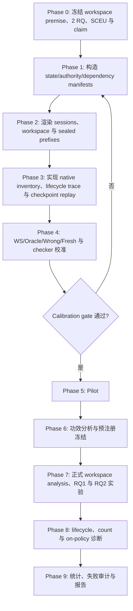

# LHMSB Paper Framing：Workspace、State Evolution 与 Behavioral Drift

> 状态：论文级主线草案，等待项目负责人确认后冻结。
>
> 日期：2026-07-16

## 1. 一句话主线

本 benchmark 研究的不是“agent 能否回忆一个旧事实”，而是：在历史对话被清空、persistent workspace 仍然存在的跨 session 长程任务中，memory system 能否维护**正确且不断演化的任务状态**，并让仍然有效的目标和约束持续控制后续计划与行为。

论文不再设置六个并列 Research Questions，而采用更集中的结构：

1. 一项 protocol premise：workspace 会改变 memory 的可识别价值；
2. 两个 substantive RQs：状态演化/冲突解决与长期行为漂移；
3. 一项方法贡献：State–Continuation Evaluation Unit。

Handoff、write-to-continuation alignment、memory-count scaling 和 retrieved-vs-used 保留，但作为**诊断维度与因果工具**，不再与两个核心问题竞争论文篇幅。

## 2. 为什么必须先讨论 Workspace

长程 agent 的持久状态通常不只存在于 memory system 中。代码、文件、实验结果、配置、日志和项目产物本身已经构成 persistent workspace。若 benchmark 直接比较“有 memory”与“没有任何历史状态”，会把 workspace 本来能够提供的续作能力错误归因给 memory。

Workspace 对 benchmark 有三层影响：

1. **替代作用**：显式写在文件中的状态不一定需要 memory 重复保存；
2. **互补作用**：目标 authority、长期约束、决策理由、失败诊断和开放承诺通常不会自然地完整出现在 workspace 中；
3. **干扰作用**：过期文件、旧分支和中间产物可能与当前状态冲突，memory 需要帮助 agent 判断什么仍然有效。

因此，主要反事实必须是 `workspace-only`，而不是 `no-memory/no-state`。每个 gold state unit 按以下方式标注：

- **explicit**：workspace 直接表达当前值；
- **derivable**：可通过预注册工具和有限恢复操作推出；
- **absent**：workspace 无法恢复。

这里的 workspace 与 [Workspace-Bench](https://arxiv.org/abs/2605.03596) 的研究对象不同：后者评估 agent 利用大型文件依赖的能力；本项目把 workspace 当作 memory 评测中必须控制的持久状态来源。

Workspace analysis 是后续两个 RQ 的**识别前提和 motivating result**，不作为能力型 Research Question。它检验：

- memory gain 应满足 `absent > derivable > explicit`；
- workspace 已充分表达状态时，native memory 的平均增益应接近零，负增益表示冗余或错误 memory 干扰；
- memory 的主要价值不只表现为终点成功率，还包括减少重新读取、重复实验和错误返工。

## 3. 两个核心 Research Questions

### RQ1：State evolution and conflict resolution

> Memory systems 能否在长程任务中维护正确的演化状态，并解决影响后续计划与行为的状态冲突？

核心事件：

- replace / supersede；
- revoke / expire；
- reopen；
- priority change；
- scope-specific conflict；
- branch invalidation / rollback；
- 不同 authority 的相互矛盾陈述。

核心假设：

- 系统应依据 authority、scope 和 validity window，而不是简单使用 `latest wins`；
- 旧状态可以保留为 history，但不能继续作为 current state 控制行为；
- 上游状态失效后，依赖它的结论、计划节点和开放事项应被同步撤销或标记待复核；
- “当前状态被正确保存”与“后续行为正确适应”需要分别测量。

这是论文的第一个主要能力问题；具体缺陷与系统差异需由实验结果支持后才能写成 empirical claim。

### RQ2：Long-horizon behavioral drift

> Memory systems 能否在跨 session 长程任务中维持有效目标和约束的行为控制，避免随距离增长发生系统性漂移？

RQ2 固定测量三个表现：

1. **Constraint influence decay**：仍有效的约束逐渐失去行为影响；
2. **Plan–goal divergence**：当前计划逐渐偏离原始全局目标；
3. **Local-over-global override**：局部子目标在没有授权时错误覆盖全局目标。

一次 late failure 只有同时满足以下条件才进入 drift 统计：

1. agent 在 early matched challenge 或 fresh-reminder 条件中证明过能够正确处理；
2. 目标或约束在 late checkpoint 仍有效；
3. early 与 late challenge 在结构和难度上匹配；
4. 中间没有合法撤销、替换、优先级变化或足以合理改变行为的新证据；
5. late 计划或动作确实违反目标层级或降低全局目标可达性。

初始不会做记为 `initial non-compliance`；合法改变记为 `valid adaptation`；单次且 replay 不稳定的错误记为 `behavioral lapse/uncertain`。系统性的 long-horizon drift 必须表现为行为影响或正确率随 session distance 稳定下降。

这是论文的第二个主要能力问题。论文不声称首次提出 behavioral state decay；近期工作已经明确讨论了这一现象。我们的创新是把它变成 workspace-controlled、cross-system、可程序化并可做生命周期归因的 benchmark。

## 4. 方法贡献：State–Continuation Evaluation Unit

### 4.1 为什么需要新的实验单位

事实 QA 的单位是一个 question；任务 benchmark 的单位通常是一个 episode。前者看不到行为，后者只能看到最终成败，两者都无法回答一次失败究竟来自：

- 没有写入；
- 写入了错误或过期状态；
- 没有检索；
- 已检索但没有进入模型输入；
- 已对模型可见但没有影响计划或动作；
- memory 使用正确，但一般规划或执行仍然失败。

本 benchmark 暂将基本评价单位命名为 **State–Continuation Evaluation Unit（SCEU，状态—续作评测单元）**；名称可在论文写作阶段调整，但其结构先冻结。

### 4.2 SCEU 定义

一个 SCEU 连接：

1. 前序 session 中出现或更新的一个 focal task state；
2. 该状态的 authority、scope、validity 和 dependency history；
3. checkpoint 时完全固定的 workspace；
4. 一个未来 continuation opportunity，在这里该状态应该影响或不应该影响行为；
5. agent 的计划、动作和可执行结果。

机器可读结构：

```text
SCEU:
  episode_template
  trajectory_seed
  focal_state_ids
  state_type
  authority
  scope
  validity_window
  transition_history
  dependency_closure
  workspace_recoverability
  checkpoint
  session_distance
  continuation_request
  valid_action_set
  global_utility
  local_utility
  memory_condition
  continuation_seed
```

一个真实 continuation 可以依赖多个状态。SCEU 为其中一个 focal state 或一个最小 dependency closure 指定主要归因目标；同一 continuation 的多个 units 在统计时按 episode 聚类，不能假装彼此独立。

### 4.3 每个 SCEU 的分数向量

SCEU 不输出单一“记忆分”，而输出不同层级的观测和得分：

```text
state observed
  → correctly stored/current
  → retrieved
  → model-visible
  → causally used
  → correct continuation behavior
  → task outcome
```

主要字段：

- workspace recoverability；
- stored/current-state verdict；
- retrieved 与 model-visible verdict；
- causal-use effect；
- state-transition/conflict score；
- constraint、goal 或 local/global behavior score；
- continuation score 与最终 task result。

这样既能评价“存得好不好”，又能评价“用得好不好”，并允许一个评价单元包含多个互补分数。

### 4.4 SCEU 的实验优势

- **可配对**：同一 prefix、workspace、checkpoint 和 challenge 可以跨 memory condition 重放；
- **可纵向**：同一 latent state 可在 early、middle、late 独立 checkpoint forks 中测试；
- **不污染**：probe branch 不回写主轨迹，早期测试不会提醒晚期 agent；
- **可归因**：支持 write-drop、retrieve-drop、visible-target drop 和 counterfactual replacement；
- **可聚合**：SCEU 可按 state type、transition、horizon、workspace recoverability 和 system 汇总，同时保留 episode-level task score。

实验单位设计是论文的主要方法贡献，而不是第四个 Research Question。

## 5. 原六点如何降为诊断维度

| 原方向 | 新定位 | 服务于 |
|---|---|---|
| Marginal value beyond workspace | Protocol premise / motivating analysis | 识别 memory 的真实边际价值 |
| Handoff sufficiency and selectivity | Boundary snapshot diagnostic | Workspace analysis、RQ1 |
| Write-to-continuation alignment | Lifecycle diagnostic | RQ1，并定位 storage failure |
| State evolution and conflict resolution | 核心 RQ1 | 主要 claim |
| Memory-count scaling and selectivity | Robustness/stress axis | 横跨 workspace analysis、RQ1、RQ2，不单独成 RQ |
| Long-horizon behavioral drift | 核心 RQ2 | 主要 claim |
| Retrieved vs. used | Causal attribution method | 主要服务 RQ2 |

这保留了六点中的实验信息，但论文 narrative 只围绕 workspace 识别前提和两个核心问题推进。

## 6. 统一实验协议

### 6.1 Fact/state-first generation

先生成隐藏的结构化状态，再渲染成 session 对话、工具结果和 workspace artifacts：

```text
G0: global goal and acceptance predicate
C: constraints with authority/scope/validity
F: task facts and versions
P: milestone/dependency graph with alternative valid paths
U: authorized updates and invalidations
g_t: local subgoals
D_t: distractors and local lures
W_t: task workspace
O_t: future continuation opportunities
```

被测系统只能看到渲染后的 observations；看不到 gold IDs、validity labels、dependency graph 或评分字段。主要判定来自状态机、单元测试和 action verifier；自由文本 judge 仅用于无法确定的 object-to-gold alignment，并报告 uncertain share。

### 6.2 Session 与状态通道隔离

- 每个新 session 使用新的 action-model conversation identity；
- 不提供历史对话或 provider-side previous-response chain；
- task workspace 持续存在并保持逐字节配对；
- memory-owned files、数据库和 notes 属于 memory treatment，不计入 WS baseline；
- 当前请求与 workspace 使用固定保留区，memory 只能进入独立 slot，不能挤掉当前任务信息；
- 使用 WS-only canary 检查是否存在 hidden context leakage。

### 6.3 原生写入

Benchmark 不把 gold fact list 直接写入系统。系统按 documented mode 运行：

- **system-ingest**：系统接收相同的 session trace，并自行抽取、合并和更新；
- **agent-managed**：系统的原生 memory scaffold 决定 memory tool calls。

两类模式分别标注。主要因果比较使用 sealed predecessor trajectory；完整 on-policy agent-managed 运行作为外部有效性子实验。

### 6.4 主要条件

| 条件 | 作用 |
|---|---|
| WS | persistent workspace-only 强基线 |
| WS + Native Memory | 正式系统比较 |
| WS + Oracle Current State | 当前最小充分状态上界 |
| WS + Wrong/Stale State | 指标敏感性与 harmful-memory control |
| Native Store + Oracle Selection | 区分已经写对但原生 retrieval 失败 |
| Fresh Reminder | 区分 behavioral-control failure 与一般能力失败 |

Oracle、Wrong/Stale、Oracle Selection 和 Fresh 只用于诊断，不进入正式系统排行榜。

## 7. Motivating analysis：Workspace 的影响

对每个 `(episode, checkpoint, continuation seed)` 配对运行 WS、WS + Native 和 WS + Oracle。

定义：

\[
MVW_{e,t}
=
S_{e,t}(WS+Native)-S_{e,t}(WS)
\]

主要报告：

- continuation score 与完整任务成功率；
- MVW 的 paired effect 与置信区间；
- memory-prevented failure 与 memory-induced failure；
- 重复读取、重复实验、错误重试和返工动作；
- explicit、derivable、absent 三层结果。

若 `WS + Oracle` 也不能优于 WS，则该 unit 没有可测 memory headroom，不能用来支持 memory-dependent claim，但仍保留在整体任务结果中。

## 8. RQ1 实验：State evolution and conflict resolution

### 8.1 Paired transition templates

每个基础模板生成成对版本：

- 状态稳定 vs. 合法 replace；
- 约束继续有效 vs. 正式 revoke；
- 子目标关闭 vs. 合法 reopen；
- 无权限的新近陈述 vs. 有 authority 的 priority change；
- 单 scope 更新 vs. 不同 scope 并存；
- 正常分支 vs. 上游假设失效后的 branch invalidation。

措辞、新近性、选项位置和 authority 方向做 counterbalancing，防止 `latest wins` 或固定选项偏好碰巧得分。

### 8.2 主指标

- Current-state fidelity；
- Authority-aware conflict resolution；
- Stale-as-current rate；
- Invalidation propagation；
- Rollback/reopen correctness；
- Update latency；
- Downstream continuation consistency。

State snapshot 和行为适应分别报告：

- store 中没有 current state：write/update failure；
- current state 已存但没有返回：retrieval/resolution failure；
- current state 已对模型可见但仍按旧状态行动：utilization/control failure；
- 合法更新后仍坚持旧状态：stale adaptation failure。

### 8.3 辅助诊断

- Handoff coverage/selectivity 检查 boundary snapshot 是否充分；
- Write-to-continuation alignment 检查 future-required state 是否在 first need 前写入并保留；
- write-drop 与 oracle rescue 验证关键写入的下游因果作用；
- `alignment-uncertain` object 同时报告上下界，不由 LLM judge 单独决定主要结论。

## 9. RQ2 实验：Long-horizon behavioral drift

### 9.1 Checkpoint forks

对同一 latent state 在距离 `1、3、7、15` 个 session handoffs 的 checkpoint 独立分叉 matched challenges；在预注册子集增加 31-session stress。Probe 输出不回写主轨迹。

### 9.2 Constraint influence decay

构造 constraint-active 与 constraint-off/A-B 对称版本：

\[
CI(d)
=
P(a=a_C\mid C\ active,d)
-P(a=a_C\mid C\ absent,d)
\]

\[
CIR(d)=CI(d)/CI(d_{early})
\]

同时报告 constraint violation、首次违规 hazard 和 drift-free survival。Early influence 接近零时，CIR 为 `N/A`，该 unit 属于初始能力不足。

### 9.3 Plan–goal divergence

Agent 输出结构化 `current_global_goal`、`selected_milestone_ids` 和 `next_action_ids`。检查计划是否仍位于至少一条合法目标路径，并在可执行环境中计算：

\[
GRL(s,a)
=
\frac{V_G^*(s)-Q_G^*(s,a)}{V_{max}-V_{min}}
\]

主要报告 Plan–Goal Alignment、Goal Reachability Loss，以及首次 plan divergence 到显式失败之间的 warning lead。

### 9.4 Local-over-global override

每个 probe 同时提供：

- \(a_G\)：局部可接受且保持全局目标；
- \(a_L\)：局部收益更高但损害全局目标。

只有 \(a_G\) 确实可行时，选择 \(a_L\) 才判为 override。报告 Local Override Rate 和按全局损失加权的 WLOR；另设无全局冲突的 local-only control，防止无能力 agent 获得虚假低 drift。

### 9.5 Native–Oracle–Fresh 分解

| 结果 | 主要解释 |
|---|---|
| Native 下降、Oracle current state 稳定 | write/state maintenance/retrieval failure |
| Oracle 下降、Fresh reminder 稳定 | state 已可见但行为权重不足，即 behavioral-control failure |
| Native、Oracle、Fresh 都下降 | 一般规划或执行能力问题 |
| Native 与 Oracle 都稳定 | memory 成功维持长期行为控制 |

RQ2 不预先定义单一总分。Constraint influence、plan–goal、local-over-global 和 survival 分别报告。

## 10. Retrieved 与 Used 的操作化

- **Retrieved**：native backend 返回目标 object；
- **Model-visible**：相关内容实际进入 action model 输入；
- **Causally used**：删除或受控替换目标 memory 后，预注册行为分数在多个 replay seeds 上发生方向正确的配对变化。

对诊断子集运行：

1. full visible memory；
2. visible-target leave-one-out；
3. 对称 counterfactual replacement；
4. workspace、其余 memory、模型配置和 continuation seed 保持一致。

删除测试估计必要性；replacement 测试方向性控制。仅仅复述或引用 memory 不算 used。若 workspace 或其他 objects 提供等价信息，删除无效应应标记为 redundant/recoverable，而不是直接判为 unused。

## 11. Memory-count 的新定位

Memory-count 不再是独立 RQ，而是 workspace analysis 与两个核心 RQ 的 stress axis。

- 主计数：checkpoint-level \(N_{live}\)；
- 辅助计数：累计 \(N_{write}\)、每次 \(N_{retrieved}\)；
- update 同一稳定 ID 不增加 \(N_{live}\)；
- deleted/tombstoned objects 不计入 \(N_{live}\)；
- 无法审计原生 object inventory 的系统不进入 count analysis。

使用 fixed-required 与 proportional-load 两种 regime，候选对象数为 `4、16、64、256`，必要时加入 `1,024` stress。原 memory-count 设计中的 token 或 token-equivalent 不再作为 scaling 自变量或效率分母；资源成本只作工程诊断。

结果报告 continuation 与 state/drift metrics 随 \(N_{live}\) 的曲线，不用单一 `gain/N_live` 给系统排名。

## 12. 统计分析

- 基本单位为 SCEU，但 bootstrap 和 mixed-effects model 按 episode/template 聚类；
- Workspace analysis 使用 checkpoint-level paired differences；
- RQ1 模型包含 `system × transition_type × chain_length × authority_gap`；
- RQ2 核心检验为 `memory_condition × session_distance`，并用 interval-censored survival model 估计 drift onset；
- Native–Oracle–Fresh 和 drop/replacement 报告 paired average treatment effect；
- 三类 drift 分量分别做多重比较校正；
- 任务族、state type 和 agent model 分层报告，宏平均不能隐藏方向相反的子组。

## 13. 实验流程



### Pilot 建议

```text
2 task families × 12 templates × 2 trajectory seeds
= 48 sealed prefixes

48 prefixes × 3 checkpoint forks × 5 conditions
= 720 continuation branches
```

Wrong/Stale、Fresh 和 causal replay 只在诊断子集运行。若 continuation 随机方差明显，再增加 continuation seeds。正式样本量由 pilot 功效分析决定。

### 关键校准门槛

- Oracle current state 在 memory-dependent units 上稳定优于 WS；
- WS-sufficient controls 不产生虚假 memory gain；
- 合法更新的 drift false-positive rate 不高于 5%；
- early competence pass rate 不低于 70%；
- 至少 80% 核心 behavior probes 可程序化判定；
- context-leak canary 通过；
- 日志可区分 stored、retrieved、model-visible 和 intervention target；
- object alignment evaluator 与人工审计 \(\kappa\ge0.80\)。

## 14. 论文 Claim–Evidence Map

| 角色 | 论文表述 | 所需证据 |
|---|---|---|
| 识别前提 | Persistent workspace 是长程 memory 评测中必须控制的独立状态通道 | recoverability annotation、WS/Native/Oracle 配对与 headroom 校准 |
| 方法 claim | SCEU 将状态维护、memory access、因果使用、续作行为与任务结果连接在同一可配对单位中 | schema 完整性、checkpoint replay、lifecycle attribution 与复现审计 |
| RQ1 empirical claim | Memory systems 在状态替换、权限冲突和依赖失效上的表现存在可测且可归因的差异 | paired transition templates、state snapshot 与行为适应的分层结果 |
| RQ2 empirical claim | 在没有合法更新时，有效目标与约束的行为控制可能随 session distance 系统性衰减 | matched checkpoint curves、Native–Oracle–Fresh、causal replay 与 survival analysis |
| 归因 claim | Retrieved 或 model-visible memory 不等于 behaviorally used memory | visible leave-one-out 与 counterfactual replacement |

其中方法 claim 可以在协议验证后成立；RQ1、RQ2 及 retrieved-vs-used 的经验性结论必须等正式结果产生后再确定方向和强度。

## 15. 不主张什么

- 不声称首次提出 memory lifecycle；
- 不声称首次发现 behavioral state decay；
- 不把 workspace learning 本身作为 benchmark 对象；
- 不把 native memory object count 当作跨系统完全等价的信息容量；
- 不把结构化任务中的 drift 外推为一般 AI alignment；
- 不依赖单一综合分数或纯 LLM judge 支撑主要结论。

## 16. 对当前 v1 的实施影响

当前代码不能直接支持这套论文协议：

- 没有真正的 task-level persistent workspace condition；
- harness 仍会对事件自动调用 `add_memory`，不等于系统原生写入选择；
- `stored_memory_count` 是累计 IDs，不是 checkpoint-level \(N_{live}\)；
- change/retract 没有完整的 native update/merge/delete lifecycle；
- 当前 drift taxonomy 仍是 stale fact、constraint violation 和 behavioral flip；
- 没有 SCEU、authority/scope/dependency schema、checkpoint forks 或 causal-use replay。

设计确认后，实施应按以下顺序推进：

1. SCEU 与 state manifest schema；
2. task workspace 与 session isolation；
3. native write mode 和 object inventory；
4. checkpoint snapshot/replay；
5. RQ1 state-transition checkers；
6. RQ2 behavioral checkers；
7. report 与旧规范迁移。

数据集生成、状态 schema、workspace 变体、SCEU 派生和质量门槛见 `2026-07-16-dataset-construction-plan.md`；六维详细测量定义保留在 `2026-07-16-six-dimension-measurement-notes.md`，作为实现与论文附录参考。
